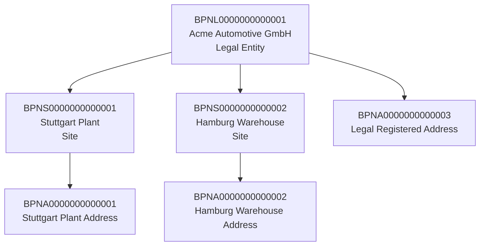
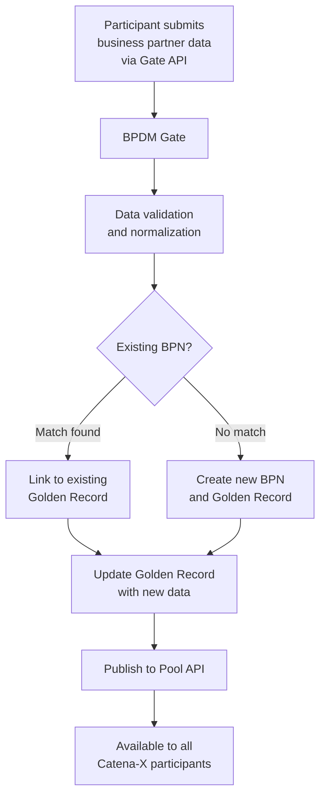
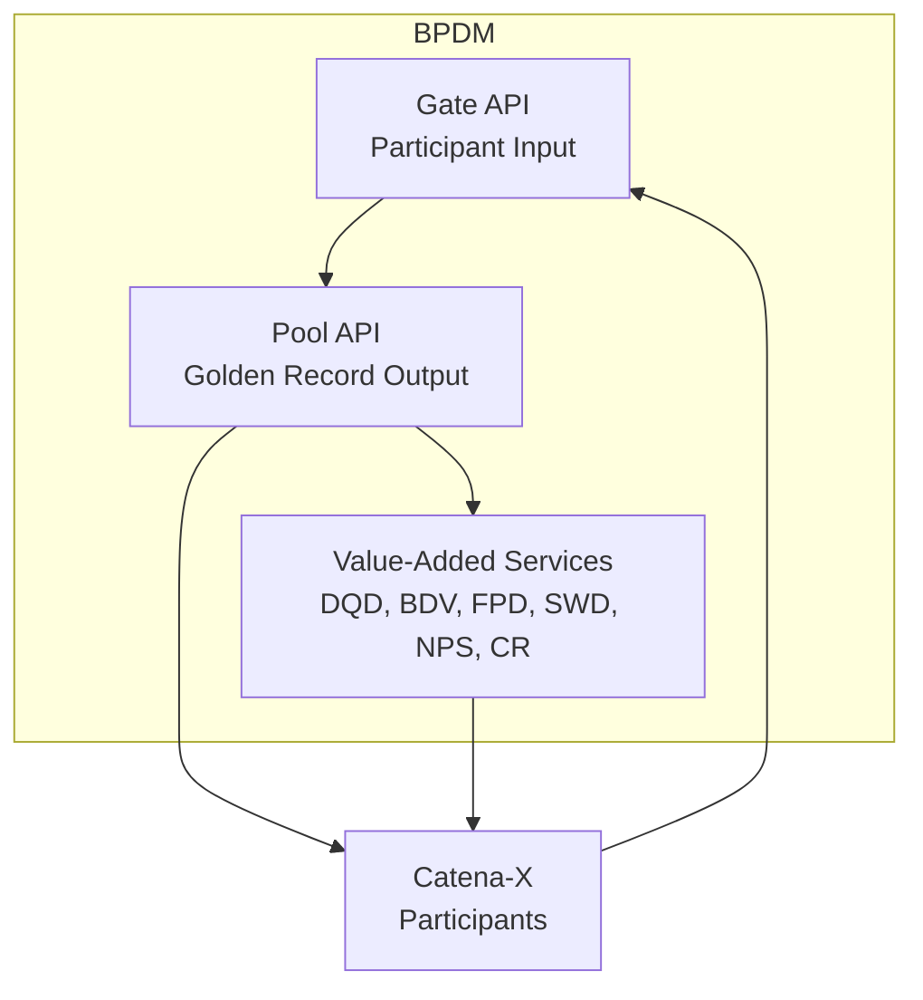

# Business Partner Number (BPN) Concept in Catena-X

## Overview

The **Business Partner Number (BPN)** is the fundamental identity anchor for organizations participating in the Catena-X data space. Every company, site, and address in Catena-X has a unique, persistent BPN that serves as the reference point for all data exchange, policy enforcement, and trust relationships.

:::info Related Standard
**CX-0010** - Business Partner Number *(See [Standards](../../standards/overview))*
:::

:::info What You'll Learn

- What a BPN is and the different BPN types
- The structure and format of BPN identifiers
- How BPNs are assigned and managed (Golden Record)
- The role of BPN in data sovereignty and policy
- BPDM — the Business Partner Data Management ecosystem
- How to use BPNs in application development
:::

## What is a BPN?

A **Business Partner Number** is a globally unique identifier assigned to a business entity participating in the Catena-X network. It serves multiple purposes:

1. **Identity**: Uniquely identifies a company, site, or address
2. **Trust anchor**: Basis for credential issuance and verification
3. **Policy parameter**: Used in EDC access control policies
4. **Discovery key**: Maps to DID and connector endpoints via BDRS

```
BPNL 0000 0000 0000 1
│    │    │    │    │
│    │    │    │    └── Check digit (Luhn algorithm)
│    │    │    └─────── Sequential number (10 digits)
│    │    └──────────── Reserved (4 chars)
│    └───────────────── Type suffix (4 chars)
└────────────────────── Prefix "BPN" (3 chars)
```

## BPN Types

Catena-X defines three types of BPNs for different business entities:

### BPNL — Legal Entity

Represents an **organization** (legal entity) — typically a company or business.

```
BPNL0000000000001
```

**Examples:**

- A car manufacturer's legal entity
- A tier-1 supplier's parent company
- A software service provider

**Characteristics:**

- Issued by the BPN Issuer (core issuer)
- Basis for Membership credential
- One per legal company
- Persistent — never changes or reused

### BPNS — Site

Represents a **physical site/location** of a legal entity — a factory, warehouse, or office.

```
BPNS0000000000001
```

**Examples:**

- A manufacturing plant in Stuttgart
- A logistics warehouse in Hamburg
- A research center in Munich

**Characteristics:**

- Linked to a parent BPNL
- A legal entity can have multiple sites
- Used for logistics and manufacturing tracking

### BPNA — Address

Represents a **physical address** of a site or legal entity.

```
BPNA0000000000001
```

**Examples:**

- The registered address of a company
- A shipping dock address
- An invoicing address

**Characteristics:**

- Linked to a BPNL or BPNS
- Most granular location identifier
- Used for shipment and invoice routing

## The BPN Hierarchy



## The Golden Record

The **Golden Record** is the authoritative, curated, deduplicated record of business partner data in Catena-X. It is maintained by the **BPDM (Business Partner Data Management)** service.

:::info Why a Golden Record?
In large supply chains, the same company may be known by different names, addresses, and identifiers in different systems. The Golden Record creates a single, authoritative, deduplicated master data record accessible to all participants.
:::

### Golden Record Creation Process



### Data Sources for Golden Record

| Source | Type | Examples |
|---|---|---|
| Self-submitted | Participant's own data | Name, address, LEI |
| External databases | Third-party enrichment | Dun & Bradstreet, Open Sanctions |
| Value-Added Services | Specialized verification | Legal entity validation, sanctions check |

## BPDM — Business Partner Data Management

The **BPDM** service provides the infrastructure for managing business partner data:



### Gate API

Each participant has their own **Gate** — a private interface to submit and receive their business partner data:

- **Upload**: Submit your business partners' data for enrichment
- **Download**: Receive your business partners' curated Golden Record data
- **Changelog**: Track what changed in your business partner records

### Pool API

The **Pool** provides read access to all Golden Records:

- Query by BPN, name, address, identifier
- Find parent/child relationships
- Access curated, deduplicated data

### Value-Added Services (VAS)

Specialized services built on top of BPDM data:

| Service | Purpose | Policy Purpose |
|---|---|---|
| **Data Quality Dashboard (DQD)** | Assess quality of business partner data | `cx.bpdm.vas.dataquality.*` |
| **Bank Data Validation (BDV)** | Verify bank account information | `cx.bpdm.vas.bdv.*` |
| **Fraud Prevention Detection (FPD)** | Screen for fraud risks | `cx.bpdm.vas.fpd.*` |
| **Sanctions & Watchlist Detection (SWD)** | Trade compliance screening | `cx.bpdm.vas.swd.*` |
| **Natural Person Screening (NPS)** | Verify against natural person databases | `cx.bpdm.vas.nps.*` |
| **Country Risk (CR)** | Assess country-level risks | `cx.bpdm.vas.countryrisk:1` |

## BPN in Data Sovereignty and Access Control

BPNs play a central role in EDC access control:

### Restricting Access to Specific Partners

```json
{
  "permission": [{
    "action": "use",
    "constraint": {
      "leftOperand": "cx-policy:BusinessPartnerNumber",
      "operator": "eq",
      "rightOperand": "BPNL0000000000CUSTOMER"
    }
  }]
}
```

### BPN in Digital Twin SpecificAssetIds

BPNs control visibility of Digital Twin identifiers:

```json
{
  "specificAssetIds": [{
    "name": "customerPartId",
    "value": "CUSTOMER-PART-12345",
    "externalSubjectId": {
      "type": "ExternalReference",
      "keys": [{
        "type": "GlobalReference",
        "value": "BPNL0000000000CUSTOMER"
      }]
    }
  }]
}
```

Only the specified customer (by BPN) can see the `customerPartId` in the Digital Twin Registry.

### Membership Credential and BPN

The **BPN Credential** issued to every Catena-X participant includes:

```json
{
  "type": "BpnCredential",
  "credentialSubject": {
    "id": "did:web:participant.example.com",
    "bpn": "BPNL0000000000001",
    "holderIdentifier": "BPNL0000000000001"
  }
}
```

This credential is presented during EDC contract negotiation, allowing the provider to verify the consumer's BPN and apply BPN-based access policies.

## BPN Lookup and Resolution

### Finding a BPN by Identifier

```http
POST /companies/legal-entities/search
Content-Type: application/json

{
  "legalName": "Acme Automotive GmbH"
}
```

### Resolving a BPN to EDC Endpoint

1. Lookup DID via BDRS: `BPN → DID`
2. Resolve DID Document: `DID → DID Document`
3. Extract connector endpoint from DID Document service

```json
{
  "service": [{
    "id": "did:web:participant.example.com#edc",
    "type": "CredentialService",
    "serviceEndpoint": "https://edc.participant.example.com/dsp"
  }]
}
```

## Best Practices

:::tip For Application Developers

1. **Always validate BPN format**: Use the regex `^BPN[LSA][0-9A-Z]{12}[0-9A-Z]$`
2. **Cache BPN lookups**: BPN-to-endpoint mappings change infrequently
3. **Use BPNL for policies**: BPNL is the most common type for access policies
4. **Register your identifiers**: Register your own part/vehicle/product IDs in BPN Discovery
5. **Keep your Gate data current**: Submit updated business partner data to keep your Golden Record accurate
:::

:::warning BPN Immutability
BPNs are **permanent and immutable**. Once assigned, a BPNL is never changed or reused — even after a company merger or name change. The Golden Record is updated to reflect new names/addresses, but the BPN stays the same.
:::

## Related Standards and Topics

- **CX-0010** - Business Partner Number *(See [Standards](../../standards/overview))*
- **CX-0074** - Business Partner Gate API *(See [Standards](../../standards/overview))*
- **CX-0076** - Golden Record End-to-End Requirements *(See [Standards](../../standards/overview))*
- **CX-0077** - Data Quality Dashboard *(See [Standards](../../standards/overview))*
- [SSI Workflow](../ssi-workflow) — How BPNs are embedded in credentials
- [ODRL Policy Framework](../data-sovereignty/odrl-policy-framework) — BPN in access policies

## References

- [Tractus-X BPDM](https://github.com/eclipse-tractusx/bpdm)
- [CX-0010 Business Partner Number Standard](../../standards/overview)

---

:::note Questions?
For questions about BPN management and BPDM, consult the Business Partner Working Group or refer to CX-0010 in the [Standards](../../standards/overview).
:::
