# Dataspace Connectivity Patterns in Catena-X

## Overview

**Dataspace Connectivity** defines how Catena-X participants connect to the data space, discover other participants, and exchange data in a standardized, interoperable manner. Understanding these patterns is essential for architects building Catena-X-compatible solutions.

:::info Related Standard
**CX-0018** - Dataspace Connectivity *(See [Standards](../../standards/overview))*
:::

:::info What You'll Learn

- The core connectivity patterns in Catena-X
- How participant discovery works
- Push vs. pull data transfer patterns
- Event-driven patterns in the data space
- Scalability considerations
- Common integration patterns
:::

## The Catena-X Connectivity Stack

Catena-X connectivity is built on a layered architecture:

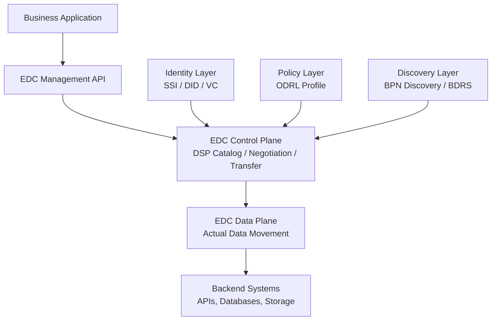

### Layer Overview

| Layer | Component | Purpose |
|---|---|---|
| **Discovery** | BPN Discovery, BDRS | Find participants and their endpoints |
| **Identity** | DIM Wallet, DIDs, VCs | Authenticate and verify participants |
| **Control** | EDC Control Plane | Negotiate contracts, manage transfers |
| **Data** | EDC Data Plane | Move actual data |
| **Policy** | ODRL Engine | Enforce usage policies |
| **Application** | Business Apps | Consume and produce data |

## Participant Discovery Pattern

Before any data exchange, participants must be discoverable:

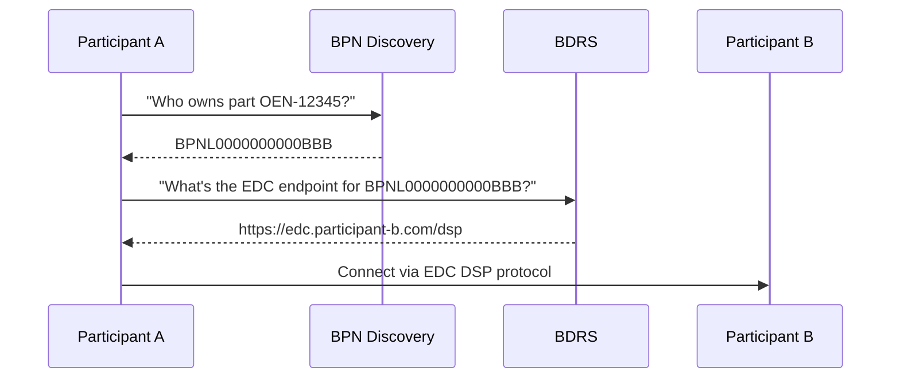

### BPN Discovery Service

Maps **business identifiers** (OEM part numbers, VINs, battery IDs) to **BPNs**:

- Input: Identifier type + value (e.g., `oen:OEN-12345`)
- Output: Business Partner Number (e.g., `BPNL0000000000BBB`)
- Registered by: Participants who own the asset

### BDRS (Business Partner Data Register Server)

Maps **BPNs to connector endpoints** via DID resolution:

- Input: BPN
- Output: DID → DID Document → EDC endpoint URL
- Operated by: Catena-X central services

### Self-Registration Pattern

Participants register their own identifiers:

```json
{
  "type": "oen",
  "key": "OEN-12345678",
  "value": "BPNL0000000000BBB"
}
```

:::tip Discovery is Opt-In
Only register identifiers you want to make discoverable. Sensitive supplier identifiers that you do not want OEMs to discover should not be registered in the BPN Discovery Service.
:::

## Data Transfer Patterns

### Pattern 1: HTTP Pull (Consumer Pull)

The most common pattern — consumer requests data on demand:

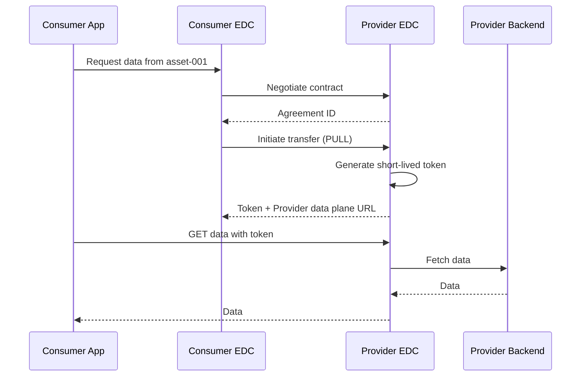

**Characteristics:**

- Synchronous, request-response
- Consumer controls when data is fetched
- Token has limited validity (minutes)
- Best for: APIs, database queries, real-time lookups

### Pattern 2: HTTP Push (Provider Push)

Provider actively pushes data to consumer:

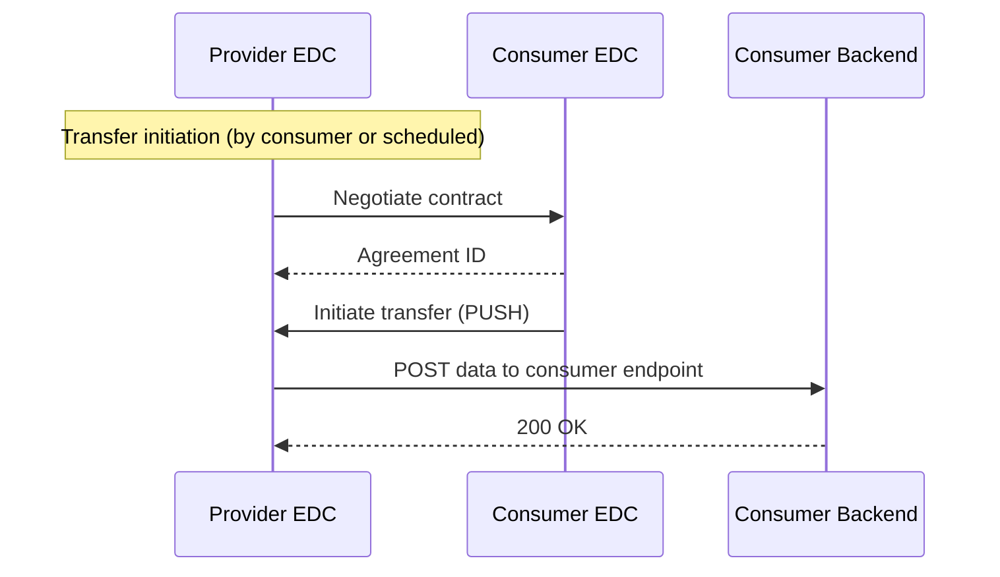

**Characteristics:**

- Asynchronous delivery
- Provider controls timing
- Consumer must expose an endpoint
- Best for: Batch data, notifications, large datasets

### Pattern 3: Cloud Storage Transfer

For large datasets via S3-compatible storage:

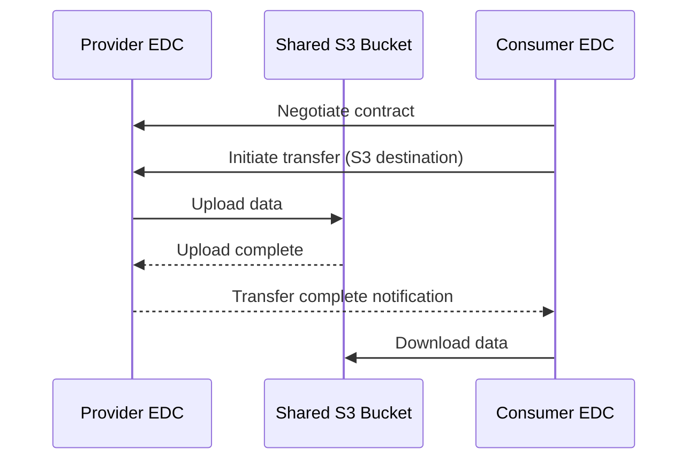

**Characteristics:**

- Large file support
- Decoupled timing
- Requires S3-compatible infrastructure
- Best for: Bulk data exports, large binary files

### Choosing a Transfer Pattern

| Scenario | Recommended Pattern |
|---|---|
| Submodel API access (DTR) | HTTP Pull |
| PCF data request | HTTP Pull |
| Quality notification | HTTP Push |
| Batch demand/capacity data | HTTP Push or S3 |
| Large historical datasets | S3 |
| Real-time inventory data | HTTP Pull |

## Multi-Hop Data Chains

Catena-X enables supply chain data to flow across multiple tiers without a central broker:

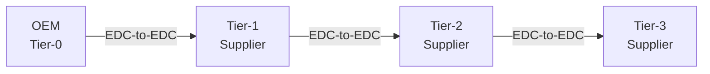

:::warning Data Sovereignty in Multi-Hop
Each hop in the chain is a separate bilateral data exchange. **Data does NOT flow through intermediate parties automatically** — each participant controls what they share with whom. The OEM cannot see Tier-2 data directly; they can only see what Tier-1 chooses to share.
:::

This is the **Industry Core** pattern — each participant in the chain:

1. Receives data from their supplier
2. Enriches it with their own manufacturing data
3. Makes their enriched data available to their customer

## Event-Driven Patterns

### Notification Pattern

For time-sensitive events (quality alerts, supply chain disruptions):

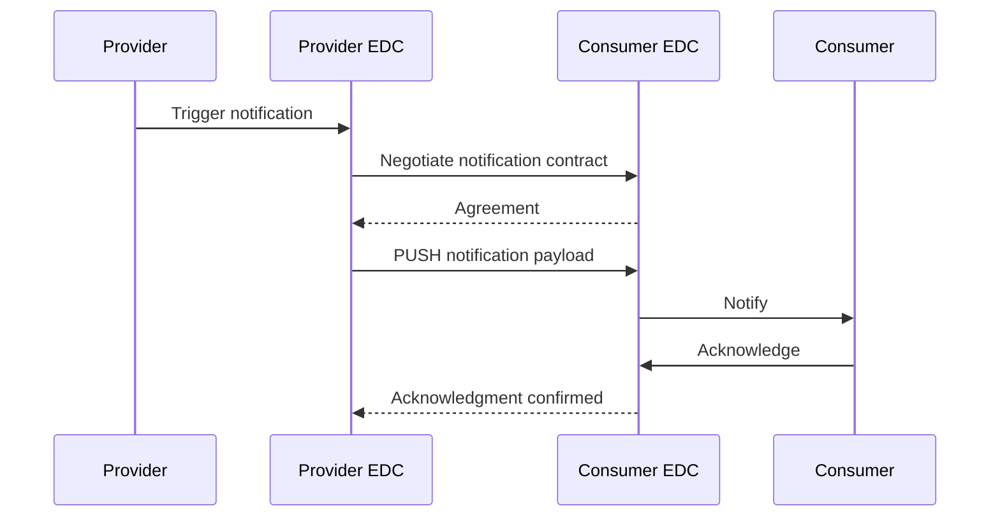

**Used by:** Quality Notifications, DCM IdBasedRequestForUpdate

### Polling Pattern

For cases where the consumer monitors for changes:

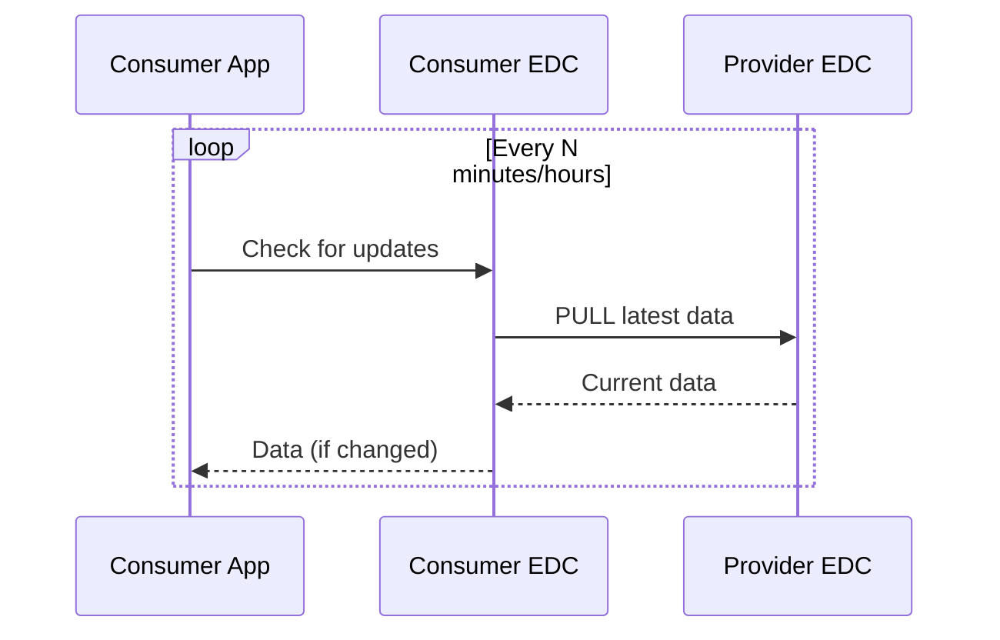

**Used by:** Demand & Capacity data, PCF updates

## Scalability Patterns

### Connector Scaling

EDC connectors can be scaled horizontally:

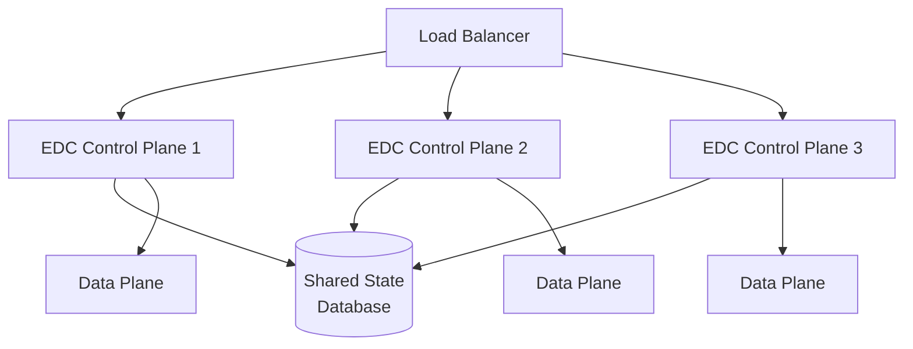

### Backend Decoupling

Decouple your backend systems from the EDC connector:

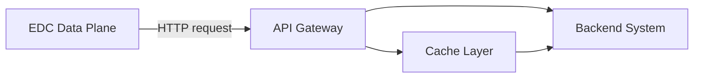

**Benefits:**

- Backend can be updated without connector changes
- API gateway provides auth/rate limiting
- Caching reduces backend load

:::tip Performance Tips

1. **Cache agreements**: Store negotiated agreement IDs to avoid re-negotiation overhead
2. **Use S3 for bulk data**: Don't stream large files through the control plane
3. **Implement backend caching**: Submodel APIs are often called multiple times for the same data
4. **Pre-negotiate contracts**: Negotiate contracts proactively rather than on first request
:::

## Common Integration Patterns

### Pattern: Application Behind EDC

The standard pattern for Catena-X applications:

```
Internet → [EDC Control Plane] → [EDC Data Plane] → [Your Application API]
```

Your application only needs to expose an HTTP API; the EDC handles all policy, authentication, and protocol.

### Pattern: Batch Data Provider

For large datasets that change infrequently:

1. Generate data file (JSON, CSV, Parquet)
2. Upload to S3 bucket
3. Register S3 location as EDC asset
4. Consumers negotiate and pull from S3

### Pattern: Real-Time API Proxy

For live data that changes frequently:

1. Implement REST API with current data
2. Register API as EDC asset
3. Consumers negotiate and proxy requests through EDC
4. Your API receives requests with EDC auth token in header

## Participant Registration Flow

New participants must complete the following to become connectable:

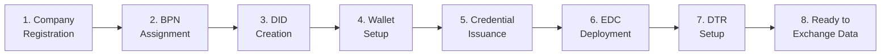

## Related Topics

- [EDC Connector Architecture](../data-sovereignty/edc-connector-architecture) — Deep dive into the EDC
- [ODRL Policy Framework](../data-sovereignty/odrl-policy-framework) — How policies work
- [SSI Workflow](../identity-trust/ssi-workflow) — Identity and authentication
- [Digital Twin Concepts](../semantic-interoperability/digital-twin-concepts) — What is being exchanged

## References

- [CX-0018 Dataspace Connectivity](../../standards/overview)
- [Dataspace Protocol Specification](https://docs.internationaldataspaces.org/dataspace-protocol/)
- [Eclipse Tractus-X EDC](https://github.com/eclipse-tractusx/tractusx-edc)

---

:::note Questions?
For questions about connectivity architecture, refer to CX-0018 in the [Standards](../../standards/overview) or the architecture working group.
:::
