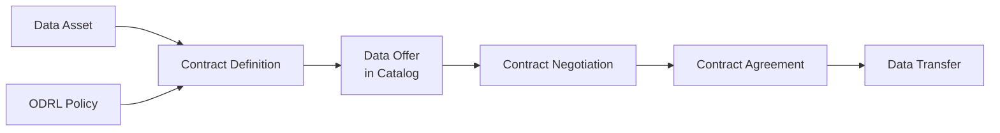
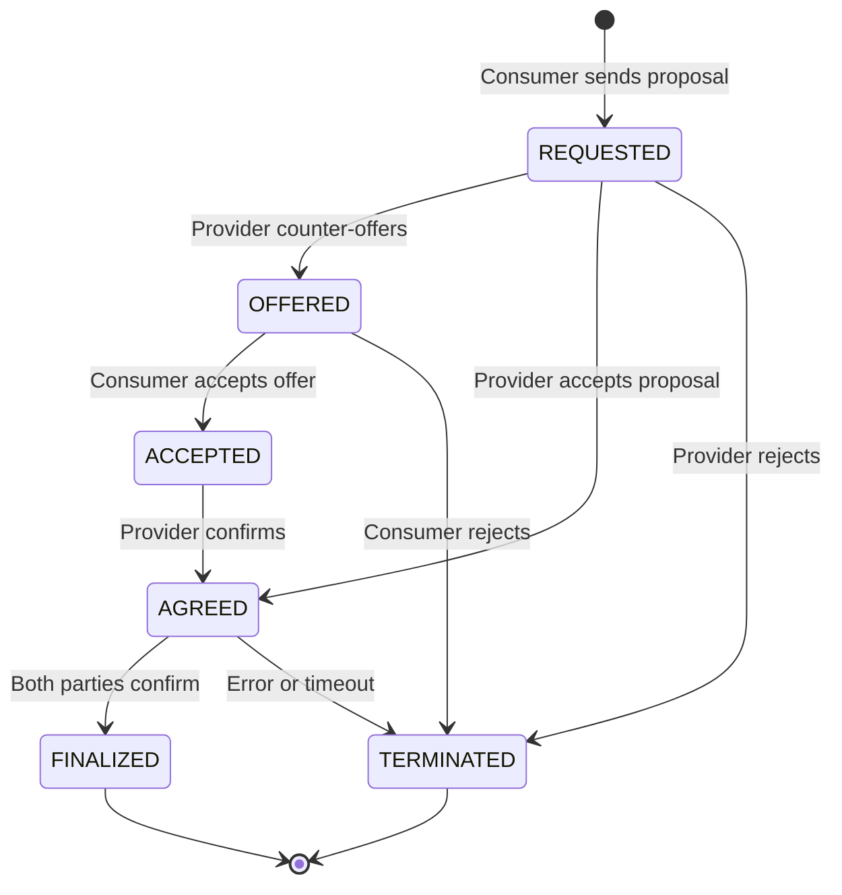
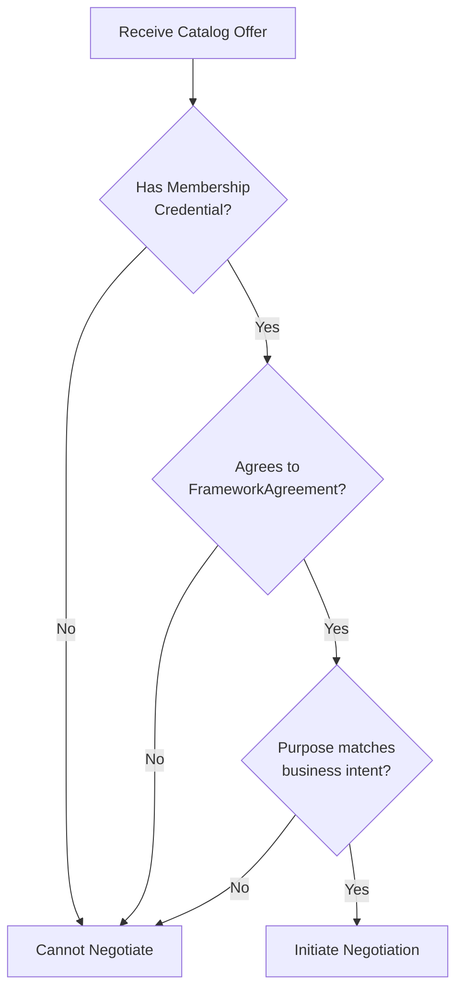
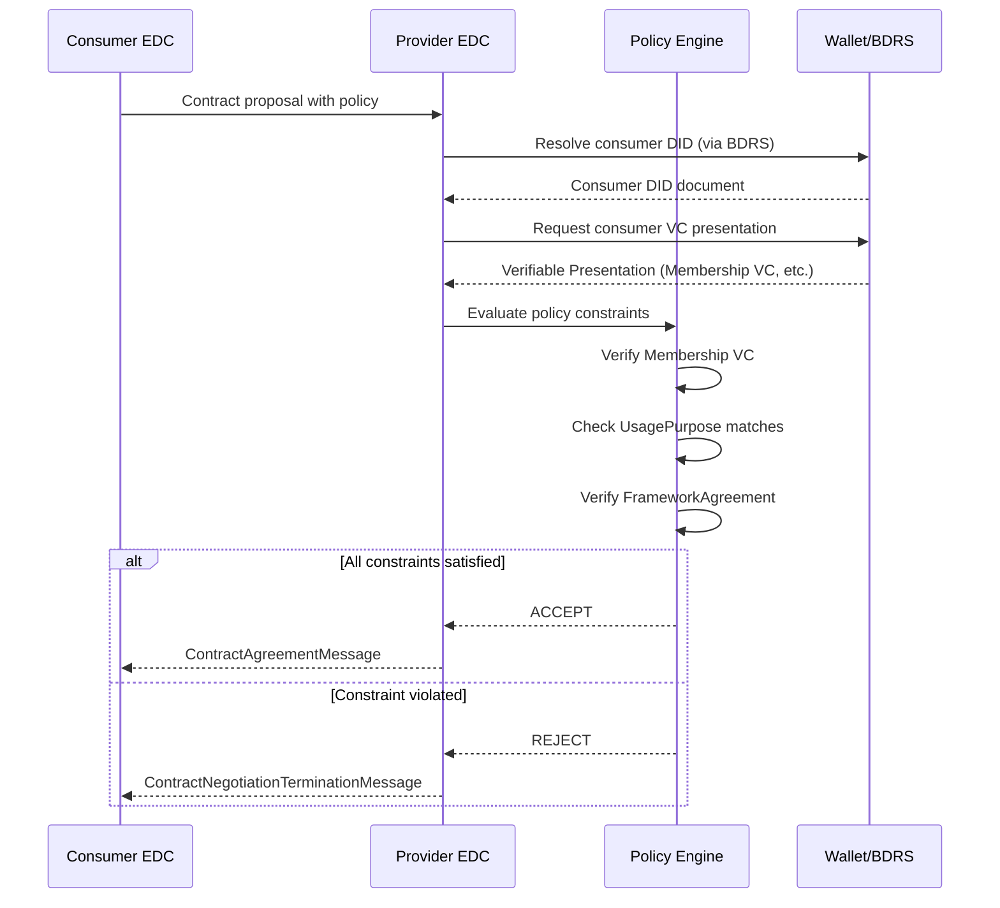

# Data Contract Negotiation in Catena-X

## Overview

Data contract negotiation is the automated process by which two Catena-X participants establish a legally binding agreement for data exchange. Unlike traditional contract management — which involves legal teams, manual review, and bilateral negotiations — Catena-X automates this process using the **Dataspace Protocol** and **ODRL policies**.

:::info What You'll Learn

- What a data contract is in Catena-X
- The full lifecycle of a data contract
- How ODRL policies enable automated negotiation
- How agreements are stored and referenced
- Policy matching and evaluation logic
- Practical negotiation patterns
:::

## What is a Data Contract?

A data contract in Catena-X is a **machine-executed agreement** between a data provider and data consumer that defines:

1. **What data** can be accessed (the asset)
2. **Under what conditions** it can be used (the policy)
3. **For how long** the agreement is valid (validity period)
4. **The legal basis** for the exchange (framework agreement + purpose)



:::tip Data Sovereignty in Practice
The contract negotiation mechanism is how **data sovereignty** is implemented technically. The data provider expresses their usage policies in the contract definition, and these are automatically enforced during every data transfer attempt.
:::

## The Negotiation Lifecycle

A contract goes through the following states:



| State | Description |
|---|---|
| **REQUESTED** | Consumer has submitted a contract proposal |
| **OFFERED** | Provider has made a counter-offer |
| **ACCEPTED** | Consumer has accepted the offer |
| **AGREED** | Mutual agreement reached |
| **FINALIZED** | Agreement is now valid for data transfer |
| **TERMINATED** | Negotiation was rejected or failed |

## Step-by-Step Negotiation

### Step 1: Catalog Request

The consumer first discovers available data offers:

```http
GET /api/v1/dsp/catalog
Content-Type: application/json

{
  "@context": {"@vocab": "https://w3id.org/edc/v0.0.1/ns/"},
  "counterPartyAddress": "https://provider.example.com/api/v1/dsp",
  "protocol": "dataspace-protocol-http"
}
```

The provider responds with a catalog containing offers:

```json
{
  "@context": "https://w3id.org/dspace/2024/1/context.json",
  "@type": "dcat:Catalog",
  "dcat:dataset": [{
    "@id": "asset-001",
    "@type": "dcat:Dataset",
    "dct:title": "SerialPart Data",
    "odrl:hasPolicy": {
      "@id": "offer-001",
      "@type": "odrl:Offer",
      "odrl:permission": [{
        "odrl:action": {"@id": "odrl:use"},
        "odrl:constraint": {
          "odrl:leftOperand": "cx-policy:UsagePurpose",
          "odrl:operator": {"@id": "odrl:eq"},
          "odrl:rightOperand": "cx.core.industrycore:1"
        }
      }]
    }
  }]
}
```

### Step 2: Policy Matching

Before initiating negotiation, the consumer must verify that it can satisfy the provider's policy requirements:



:::warning Verify Before Negotiating
Consumers should check all policy constraints **before** initiating negotiation. Attempting to negotiate with policies you cannot satisfy results in negotiation failure and wastes resources.
:::

### Step 3: Contract Proposal

The consumer sends a negotiation request with a proposed policy:

```json
{
  "@context": {
    "@vocab": "https://w3id.org/dspace/2024/1/context.json",
    "odrl": "http://www.w3.org/ns/odrl/2/",
    "cx-policy": "https://w3id.org/catenax/policy/"
  },
  "@type": "ContractRequestMessage",
  "consumerPid": "urn:uuid:consumer-pid-001",
  "offer": {
    "@type": "odrl:Offer",
    "@id": "offer-001",
    "odrl:assigner": "did:web:provider.example.com",
    "odrl:target": "asset-001",
    "odrl:permission": [{
      "odrl:action": "use",
      "odrl:constraint": {
        "odrl:and": [
          {
            "odrl:leftOperand": "cx-policy:Membership",
            "odrl:operator": {"@id": "odrl:eq"},
            "odrl:rightOperand": "active"
          },
          {
            "odrl:leftOperand": "cx-policy:UsagePurpose",
            "odrl:operator": {"@id": "odrl:eq"},
            "odrl:rightOperand": "cx.core.industrycore:1"
          }
        ]
      }
    }]
  }
}
```

### Step 4: Policy Evaluation at Provider

The provider's policy engine evaluates the consumer's proposal:



### Step 5: Agreement

If the negotiation succeeds, both parties receive a **Contract Agreement** with a unique ID:

```json
{
  "@context": "https://w3id.org/dspace/2024/1/context.json",
  "@type": "ContractAgreementMessage",
  "consumerPid": "urn:uuid:consumer-pid-001",
  "providerPid": "urn:uuid:provider-pid-001",
  "agreement": {
    "@id": "urn:uuid:agreement-001",
    "@type": "odrl:Agreement",
    "odrl:assignee": "did:web:consumer.example.com",
    "odrl:assigner": "did:web:provider.example.com",
    "odrl:target": "asset-001",
    "dct:timestamp": "2024-01-15T10:30:00Z",
    "odrl:permission": [...]
  }
}
```

## Contract Types and Use Cases

### Type 1: Open Access for Members

All active Catena-X members can access the data:

```json
{
  "permission": [{
    "action": "use",
    "constraint": {
      "leftOperand": "cx-policy:Membership",
      "operator": "eq",
      "rightOperand": "active"
    }
  }]
}
```

*Use case: Public reference data, shared industry datasets*

### Type 2: Use-Case Specific

Data may only be used for a specific, legally defined purpose:

```json
{
  "permission": [{
    "action": "use",
    "constraint": {
      "and": [
        {
          "leftOperand": "cx-policy:FrameworkAgreement",
          "operator": "eq",
          "rightOperand": "DataExchangeGovernance:1.0"
        },
        {
          "leftOperand": "cx-policy:UsagePurpose",
          "operator": "eq",
          "rightOperand": "cx.pcf.base:1"
        }
      ]
    }
  }]
}
```

*Use case: Product Carbon Footprint exchange*

### Type 3: Bilateral Contract Reference

Data exchange based on an existing bilateral business contract:

```json
{
  "permission": [{
    "action": "use",
    "constraint": {
      "leftOperand": "cx-policy:ContractReference",
      "operator": "eq",
      "rightOperand": "SUPPLY-AGREEMENT-2024-OEM-TIER1"
    }
  }]
}
```

*Use case: Supply chain partners with existing contracts*

### Type 4: Combined Conditions

Multiple constraints combined with logical AND:

```json
{
  "permission": [{
    "action": "use",
    "constraint": {
      "and": [
        {
          "leftOperand": "cx-policy:Membership",
          "operator": "eq",
          "rightOperand": "active"
        },
        {
          "leftOperand": "cx-policy:FrameworkAgreement",
          "operator": "eq",
          "rightOperand": "DataExchangeGovernance:1.0"
        },
        {
          "leftOperand": "cx-policy:UsagePurpose",
          "operator": "eq",
          "rightOperand": "cx.dcm.base:1"
        }
      ]
    }
  }]
}
```

*Use case: Demand & Capacity Management with all standard requirements*

## Agreement Validity and Re-Negotiation

### Validity Period

Contract agreements are valid for the duration specified in the policy context. Most Catena-X use cases specify **1 year** as the default duration for contract, data provision, and usage rights.

| Aspect | Duration |
|---|---|
| Contract Agreement | Typically 1 year |
| Data Provision Rights | Typically 1 year |
| Usage Rights | Typically 1 year |

### When to Re-Negotiate

Re-negotiation is required when:

- The current agreement has expired
- The data provider has updated their policy
- The consumer's credentials have changed
- The data asset definition has changed

:::tip Caching Agreements
Consumers should **cache valid agreements** and reuse them for multiple data transfers. Re-negotiating for every request is inefficient. However, consumers must check agreement expiry before attempting transfers.
:::

## Troubleshooting Negotiations

### Issue: Negotiation Always Terminated

**Possible causes:**

- Missing or expired Membership Credential
- Consumer DID not resolvable via BDRS
- Proposed policy does not match provider's required policy
- Consumer not enrolled in the required FrameworkAgreement

**Diagnostic steps:**

1. Verify your wallet has a valid Membership Credential
2. Check that your BPN is registered in BDRS
3. Compare your proposed policy against the catalog offer policy exactly
4. Confirm your registration for the relevant use case framework

### Issue: Negotiation Hangs in REQUESTED State

**Possible causes:**

- Provider connector is offline or unreachable
- Network connectivity issues between connectors
- Provider's policy evaluation service is unavailable

**Diagnostic steps:**

1. Check provider's DSP endpoint reachability
2. Review connector logs for timeout errors
3. Contact provider if the issue persists

## Best Practices

:::tip Recommendations for Data Providers

1. **Keep policies simple**: Start with Membership + UsagePurpose — add other constraints only when needed
2. **Use standard purposes**: Use official `cx.` purpose identifiers, not custom ones
3. **Separate access from contract policies**: Use access policy to control catalog visibility
4. **Set appropriate validity**: 1 year is the standard for most use cases
5. **Document your offers**: Add clear descriptions to your data assets
:::

:::tip Recommendations for Data Consumers

1. **Cache agreements**: Don't re-negotiate unnecessarily
2. **Check expiry proactively**: Monitor agreement validity and renew before expiry
3. **Use the right purpose**: Ensure your stated purpose matches your actual use
4. **Store agreement IDs**: You'll need them for every data transfer
:::

## Related Topics

- [ODRL Policy Framework](./odrl-policy-framework) — Understanding the policy language
- [EDC Connector Architecture](./edc-connector-architecture) — The technical component executing negotiations
- [SSI Workflow](../ssi-workflow) — Identity verification during negotiation

## References

- [CX-0018 Dataspace Connectivity](../../standards/overview)
- [CX-0152 Policy Constraints for Data Exchange](../../standards/overview)
- [Dataspace Protocol Specification](https://docs.internationaldataspaces.org/dataspace-protocol/)
- [ODRL Information Model](https://www.w3.org/TR/odrl-model/)

---

:::note Questions?
For questions about contract negotiation in Catena-X, refer to CX-0018 and CX-0152 in the [Standards](../../standards/overview).
:::
