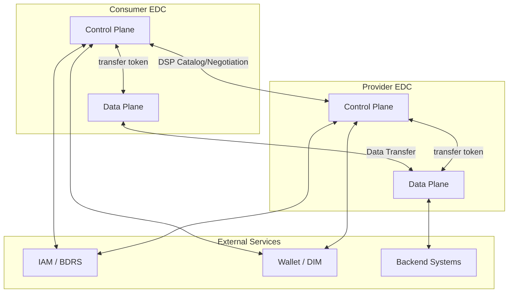
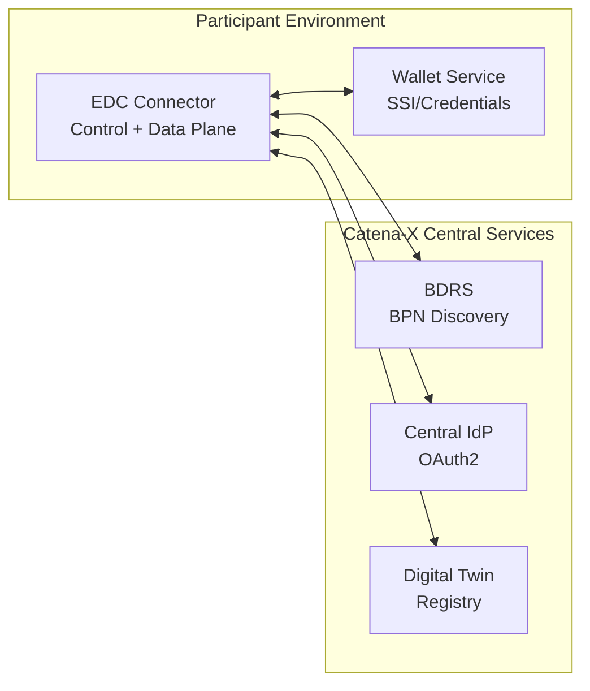
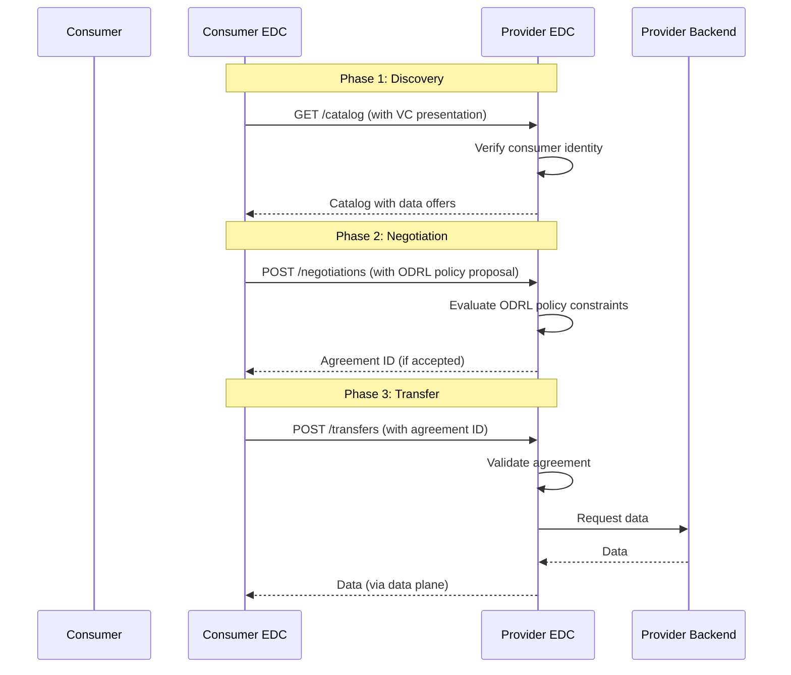

# EDC Connector Architecture in Catena-X

## Overview

The **Eclipse Dataspace Connector (EDC)** is the reference implementation of the Dataspace Protocol and is the primary data exchange component in the Catena-X ecosystem. Every participant that wants to provide or consume data in Catena-X must operate an EDC connector (or a certified equivalent).

:::info Source Repository
This knowledge is derived from the [Catena-X example EDC setup](https://github.com/catenax-eV/example-edc-setup) and the related standard **CX-0018 Dataspace Connectivity**.
:::

:::info What You'll Learn

- What the EDC connector is and why it exists
- The core components of the EDC connector
- How the connector interacts with other Catena-X components
- Data plane vs. control plane architecture
- How to set up a basic two-connector environment
- Common deployment patterns
:::

## Why the EDC Connector?

Traditional data exchange relies on bilateral API agreements, custom authentication, and manual contract management. This does not scale in a multi-party data ecosystem. The EDC solves this by providing:

```
Traditional: Company A → (custom API) → Company B
Catena-X:   Company A EDC → (Dataspace Protocol) → Company B EDC
```

| Aspect | Traditional | EDC-based |
|---|---|---|
| **Contract Negotiation** | Manual, legal teams | Automated, machine-readable (ODRL) |
| **Authentication** | API keys, bilateral agreements | SSI / Verifiable Credentials |
| **Policy Enforcement** | Manual or custom code | Built-in policy engine |
| **Interoperability** | Point-to-point integrations | Standard Dataspace Protocol |
| **Data Sovereignty** | Difficult to enforce | Enforced at connector level |

:::tip Core Principle
The EDC connector is the **trust boundary** in Catena-X. Data never leaves your control until the connector has verified that the requester meets all policy requirements.
:::

## Connector Architecture

The EDC has two main planes that work together:



### Control Plane

The control plane manages **metadata and negotiations**. It is responsible for:

- **Catalog API**: Publishing data offers and discovering offers from other connectors
- **Contract Negotiation**: Automated negotiation using ODRL policies
- **Transfer Process Management**: Initiating and tracking data transfers
- **Policy Engine**: Evaluating ODRL constraints
- **SSI Integration**: Verifying participant identity and credentials

**Key APIs:**

| API | Purpose | Protocol |
|---|---|---|
| DSP Catalog | Publish/query data catalogs | HTTPS |
| DSP Negotiation | Negotiate contracts | HTTPS |
| DSP Transfer | Manage transfer processes | HTTPS |
| Management API | Internal connector management | HTTPS (authenticated) |

### Data Plane

The data plane handles **actual data movement**. It is responsible for:

- **Data Source Connectors**: Reading from backends (S3, HTTP, databases)
- **Data Sink Connectors**: Writing to consumer backends
- **Token Validation**: Verifying transfer tokens from control plane
- **Data Transformation**: Optional format conversion

:::note Separation of Concerns
The control plane and data plane are separate components that can be scaled independently. The control plane handles many small metadata operations; the data plane handles potentially large data transfers.
:::

## Core Components in a Catena-X Deployment

Based on the Catena-X example EDC setup, a minimal Catena-X environment requires:



### BDRS (Business Partner Data Register Server)

The BDRS maps BPN (Business Partner Numbers) to DID (Decentralized Identifiers), enabling connectors to locate other participants' wallets and verify their credentials.

### Wallet / DIM (Decentralized Identity Management)

The wallet service stores the participant's Verifiable Credentials and presents them during connector authentication. See [SSI Workflow](../ssi-workflow) and [Issuer Concept](../issuer-concept) for details.

### IATPMOCK / IAT Provider

The Issuer Access Token Provider handles token issuance for EDC authentication. In the example setup, an `iatpmock` is included for testing purposes.

## The Dataspace Protocol (DSP) Flow

Every data exchange in Catena-X follows the Dataspace Protocol:



### Phase 1: Catalog Discovery

The consumer EDC queries the provider EDC's catalog to discover available data offers. The catalog response includes:

- Asset descriptions
- Applicable policies (ODRL)
- Contact endpoints

### Phase 2: Contract Negotiation

The consumer proposes a policy that must match (or be a subset of) the provider's policy. The provider's policy engine evaluates:

1. **Framework Agreement**: Is the correct DEG version referenced?
2. **Membership**: Is the consumer an active Catena-X member? (verified via VC)
3. **Usage Purpose**: Does the consumer's stated purpose match the allowed purposes?
4. **Contract Reference**: Is there a referenced bilateral contract? (if required)

### Phase 3: Data Transfer

Once an agreement is established, the consumer initiates a transfer process. The provider's data plane:

1. Validates the transfer token
2. Fetches data from the backend
3. Pushes data to the consumer (HTTP push) or makes it available for pull

## Deployment Architecture

### Helm Chart Deployment

The reference deployment uses **Helm charts** on Kubernetes. The Catena-X example EDC setup is based on the [Tractus-X Umbrella Helm Chart](https://github.com/eclipse-tractusx/tractus-x-umbrella):

```yaml
# Minimal values.yaml for two EDC connectors
provider:
  edc:
    controlplane:
      endpoints:
        management:
          port: 8081
        protocol:
          port: 8084
    dataplane:
      endpoints:
        public:
          port: 8080

consumer:
  edc:
    controlplane:
      endpoints:
        management:
          port: 8081
        protocol:
          port: 8084
```

### Example Setup Components

The `example-edc-setup` repository provides a two-connector testing environment with:

| Component | Purpose |
|---|---|
| Central IdP | OAuth2 authentication for management APIs |
| Provider EDC | Simulates a data provider |
| Consumer EDC | Simulates a data consumer |
| BDRS Server | BPN-to-DID lookup (in-memory for testing) |
| IATPMOCK | Simulates IAT token provider for SSI authentication |

:::tip Local Testing
Use the example-edc-setup to understand how two connectors interact before connecting to the live Catena-X environment. The mock components allow full end-to-end testing without real credentials.
:::

## EDC Management API

Participants interact with their own EDC through the Management API. Common operations:

### Creating a Data Asset

```json
{
  "@context": {"@vocab": "https://w3id.org/edc/v0.0.1/ns/"},
  "@type": "Asset",
  "@id": "asset-001",
  "properties": {
    "name": "SerialPart Data",
    "description": "Serial part data for industry core",
    "contenttype": "application/json"
  },
  "dataAddress": {
    "@type": "DataAddress",
    "type": "HttpData",
    "baseUrl": "https://my-backend.example.com/api/v1/parts"
  }
}
```

### Creating a Policy Definition

```json
{
  "@context": [
    "http://www.w3.org/ns/odrl.jsonld",
    {"cx-policy": "https://w3id.org/catenax/policy/",
     "@vocab": "https://w3id.org/edc/v0.0.1/ns/"}
  ],
  "@type": "PolicyDefinition",
  "@id": "policy-industrycore",
  "policy": {
    "@type": "Set",
    "permission": [{
      "action": "use",
      "constraint": {
        "and": [
          {
            "leftOperand": "cx-policy:Membership",
            "operator": "eq",
            "rightOperand": "active"
          },
          {
            "leftOperand": "cx-policy:UsagePurpose",
            "operator": "eq",
            "rightOperand": "cx.core.industrycore:1"
          }
        ]
      }
    }]
  }
}
```

### Creating a Contract Definition

```json
{
  "@context": {"@vocab": "https://w3id.org/edc/v0.0.1/ns/"},
  "@type": "ContractDefinition",
  "@id": "contract-def-001",
  "accessPolicyId": "policy-industrycore",
  "contractPolicyId": "policy-industrycore",
  "assetsSelector": {
    "@type": "CriterionDto",
    "operandLeft": "@id",
    "operator": "=",
    "operandRight": "asset-001"
  }
}
```

:::note Access Policy vs. Contract Policy

- **Access Policy**: Controls who can *see* the data offer in the catalog
- **Contract Policy**: Controls who can *use* the data (written into the agreement)

These can be different — for example, you might make an offer visible to all members but restrict usage to specific purposes.
:::

## Security Considerations

:::danger Critical Security Practices

1. **Protect the Management API**: Only expose the management API internally — never to the public internet
2. **Use secure key storage**: Private keys for SSI wallet must be stored in HSMs or equivalent
3. **Rotate credentials regularly**: Implement key rotation for connector certificates
4. **Monitor transfer logs**: Keep audit trails of all data transfers
5. **Validate policies strictly**: Ensure policy evaluation failures result in access denial
:::

## Related Standards

- **CX-0018** - Dataspace Connectivity *(See [Standards](../../standards/overview))*
- **CX-0013** - Identity and Access Management *(See [Standards](../../standards/overview))*

## References

- [Catena-X Example EDC Setup](https://github.com/catenax-eV/example-edc-setup)
- [Eclipse Tractus-X EDC](https://github.com/eclipse-tractusx/tractusx-edc)
- [Tractus-X Umbrella Helm Chart](https://github.com/eclipse-tractusx/tractus-x-umbrella)
- [Dataspace Protocol Specification](https://docs.internationaldataspaces.org/dataspace-protocol/)
- [EDC Connector Documentation](https://eclipse-edc.github.io/docs/)
- [ODRL Policy Framework](./odrl-policy-framework)

---

:::note Questions?
For questions about EDC deployment or connector architecture, refer to CX-0018 in the [Standards](../../standards/overview) or the Tractus-X community.
:::
