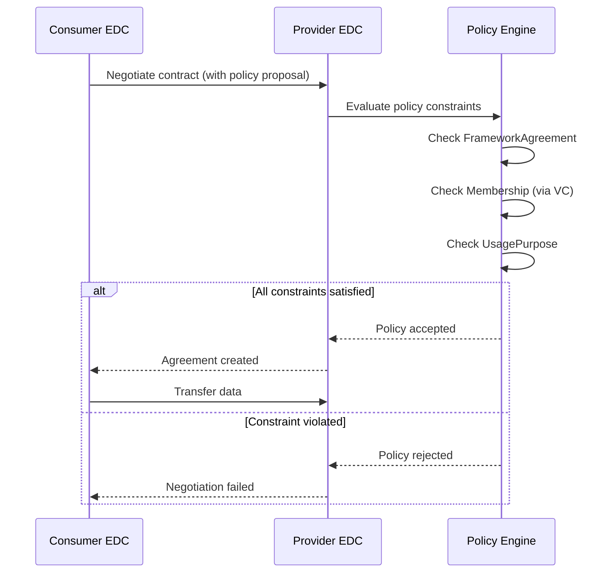

# ODRL Policy Framework in Catena-X

## Overview

The **Open Digital Rights Language (ODRL) Profile** is the cornerstone of automated contract negotiation in the Catena-X data space. It provides standardized contractual modules — permissions, prohibitions, and obligations — in a machine-readable format that enables **automated policy enforcement** across all data exchange interactions.

:::info Source Repository
This knowledge is derived from the official [Catena-X ODRL Profile repository](https://github.com/catenax-eV/cx-odrl-profile), maintained by the Catena-X Automotive Network e.V. Data Space Operations Committee.
:::

:::info What You'll Learn

- What ODRL is and why Catena-X uses it
- The structure of the Catena-X ODRL Profile
- Key policy terms: LeftOperands, RightOperands, Operators
- How usage purposes are defined per use case
- How to read and construct Catena-X policy expressions
:::

## What is ODRL?

**ODRL (Open Digital Rights Language)** is a W3C standard policy expression language. It provides a flexible and interoperable information model for representing statements about the usage of content and services.

```
ODRL Policy = { Permissions } + { Prohibitions } + { Obligations } + { Constraints }
```

In Catena-X, ODRL is used through the **Dataspace Protocol (DSP)** — the core connectivity standard — where all contract negotiations happen electronically via a registered connector.

:::tip Why ODRL in Catena-X?
By default, contract negotiations in Catena-X happen electronically via a registered connector. ODRL enables **automated, machine-readable policy checking** so that data providers can express exactly under which conditions their data may be used — and connectors can enforce those conditions automatically.
:::

## The Catena-X ODRL Profile

The Catena-X ODRL Profile (`cx-policy:profile2405`) extends standard ODRL with Catena-X-specific vocabulary. It defines three types of **policy building blocks**:

| Building Block | Role | Example |
|---|---|---|
| **LeftOperand** | What is being constrained | `cx-policy:UsagePurpose` |
| **Operator** | How it is constrained | `eq` (equals) |
| **RightOperand** | The allowed value | `cx.core.industrycore:1` |

### Profile Namespace

All Catena-X policy terms live under the namespace:

```
https://w3id.org/catenax/policy/
```

Abbreviated as `cx-policy:` in JSON-LD context:

```json
{
  "@context": [
    "http://www.w3.org/ns/odrl.jsonld",
    {
      "cx-policy": "https://w3id.org/catenax/policy/"
    }
  ]
}
```

## Policy Structure

A Catena-X policy is a **Set** (or **Offer**/**Agreement**) that contains permissions with constraints. Here is a complete example policy:

```json
{
  "@context": [
    "http://www.w3.org/ns/odrl.jsonld",
    {
      "cx-policy": "https://w3id.org/catenax/policy/"
    }
  ],
  "@type": "Set",
  "profile": "cx-policy:profile2405",
  "permission": [
    {
      "action": "use",
      "constraint": {
        "and": [
          {
            "leftOperand": "cx-policy:FrameworkAgreement",
            "operator": "eq",
            "rightOperand": "DataExchangeGovernance:1.0"
          },
          {
            "leftOperand": "cx-policy:ContractReference",
            "operator": "eq",
            "rightOperand": "x12345"
          },
          {
            "leftOperand": "cx-policy:UsagePurpose",
            "operator": "eq",
            "rightOperand": "cx.core.industrycore:1"
          }
        ]
      }
    }
  ]
}
```

:::note Reading the Policy
This policy says: **"You may use this data if** (1) you have agreed to the Data Exchange Governance framework (v1.0), AND (2) you reference contract x12345, AND (3) your purpose is establishing a digital representation of the automotive supply chain (industry core)."
:::

## Key LeftOperands

### `FrameworkAgreement`

Specifies the governance framework the data exchange is based on.

**Identifier:** `https://w3id.org/catenax/policy/FrameworkAgreement`

The current active value is **`DataExchangeGovernance:1.0`**, replacing the previous use-case-specific framework agreements (Traceability:1.0, PCF:1.0, etc.) which were deprecated in October 2024.

:::warning Deprecation Notice
The following FrameworkAgreement values are **deprecated** since October 2024:
`Traceability:1.0`, `Pcf:1.0`, `Quality:1.0`, `CircularEconomy:1.0`, `DemandCapacity:1.0`, `Puris:1.0`, `BusinessPartner:1.0`, `BehavioralTwin:1.0`

Use `DataExchangeGovernance:1.0` instead, combined with the appropriate `UsagePurpose`.
:::

### `Membership`

Verifies that the data consumer is a member of the Catena-X data space.

**Identifier:** `https://w3id.org/catenax/policy/Membership`

```json
{
  "leftOperand": "cx-policy:Membership",
  "operator": "eq",
  "rightOperand": "active"
}
```

### `ContractReference`

References an existing individual contract (frame contract or specific contract) as the basis for negotiation.

**Identifier:** `https://w3id.org/catenax/policy/ContractReference`

The `rightOperand` is a free-text reference that both parties can use to identify their contract. No version numbers are typically used.

### `UsagePurpose`

Defines the legally binding purpose for which the data may be used.

**Identifier:** `https://w3id.org/catenax/policy/UsagePurpose`

This is the most important LeftOperand for data sovereignty. It ties the data exchange to a specific, legally defined purpose.

## Standardized Usage Purposes

The following `UsagePurpose` values are officially defined and legally binding in Catena-X:

### Core Data Exchange

| Purpose | Identifier | Typical Aspect Models |
|---|---|---|
| Industry Core | `cx.core.industrycore:1` | SerialPart, Batch, SingleLevelBomAsBuilt, PartAsPlanned |
| Quality Notifications | `cx.core.qualityNotifications:1` | Notification API |
| Digital Twin Registry | `cx.core.digitalTwinRegistry:1` | DTR Asset |
| Legal Battery Tracking | `cx.core.legalRequirementForThirdparty:1` | TractionBatteryCode |

### Circular Economy

| Purpose | Identifier | Typical Aspect Models |
|---|---|---|
| Digital Product Pass | `cx.circular.dpp:1` | Digital Product Pass, Battery Pass |
| Secondary Material Content | `cx.circular.smc:1` | SMC-Calculated, SMC-Verifiable |
| Circular Marketplace | `cx.circular.marketplace:1` | Market Place Offer |
| Material Accounting | `cx.circular.materialaccounting:1` | — |

### Business Partner Data Management (BPDM)

| Purpose | Identifier | Description |
|---|---|---|
| Gate Upload | `cx.bpdm.gate.upload:1` | Curating Golden Record data |
| Gate Download | `cx.bpdm.gate.download:1` | Providing basic partner information |
| Pool | `cx.bpdm.pool:1` | Identifying participants in the data space |
| Data Quality Upload | `cx.bpdm.vas.dataquality.upload:1` | Screening data quality |
| Data Quality Download | `cx.bpdm.vas.dataquality.download:1` | Assessing own data quality |
| Fraud Prevention Upload | `cx.bpdm.vas.fpd.upload:1` | Screening for fraud |
| Fraud Prevention Download | `cx.bpdm.vas.fpd.download:1` | Assessing fraud risks |
| Sanctions/Trade Upload | `cx.bpdm.vas.swd.upload:1` | Trade compliance screening |
| Sanctions/Trade Download | `cx.bpdm.vas.swd.download:1` | Assessing trade sanction risks |
| Country Risk | `cx.bpdm.vas.countryrisk:1` | Country risk assessments |

### Supply Chain Use Cases

| Purpose | Identifier | Typical Aspect Models |
|---|---|---|
| PCF (Product Carbon Footprint) | `cx.pcf.base:1` | PCF Model, PCF Exchange API |
| Quality Management | `cx.quality.base:1` | FleetVehicles, QualityTask, PartsAnalysis |
| Demand & Capacity Management | `cx.dcm.base:1` | MaterialDemand, WeekBasedCapacityGroup |
| PURIS (Short-term Supply) | `cx.puris.base:1` | ItemStock, Short-Term Material Demand |

### Purpose Definitions

:::info cx.core.industrycore:1
*"Establishing a digital representation of the automotive supply chain to enable a component specific data exchange. As a purpose-specific requirement, the duration of (i) contract, (ii) data provision and (iii) usage right(s) as a default are all specified as 1 year."*
:::

:::info cx.pcf.base:1
*"(i) sending and receiving product-specific CO2 data and related functionalities such as (but not limited to) certificate exchange and notifications, (ii) conducting plausibility checks and validation measures, (iii) calculating aggregated PCFs of Data Consumer."*
:::

:::info cx.circular.dpp:1
*"Exchange and use of data according to the applicable public legal regulation directly requiring digital product passports or affecting the contents or handling of digital product passports."*
:::

## Policy Composition Patterns

### Pattern 1: Membership-Only Access

The simplest policy — requires only Catena-X membership:

```json
{
  "@context": ["http://www.w3.org/ns/odrl.jsonld",
    {"cx-policy": "https://w3id.org/catenax/policy/"}],
  "@type": "Set",
  "permission": [{
    "action": "use",
    "constraint": {
      "leftOperand": "cx-policy:Membership",
      "operator": "eq",
      "rightOperand": "active"
    }
  }]
}
```

### Pattern 2: Framework + Purpose (Recommended)

The standard pattern for use-case-specific data exchange:

```json
{
  "@context": ["http://www.w3.org/ns/odrl.jsonld",
    {"cx-policy": "https://w3id.org/catenax/policy/"}],
  "@type": "Set",
  "profile": "cx-policy:profile2405",
  "permission": [{
    "action": "use",
    "constraint": {
      "and": [
        {
          "leftOperand": "cx-policy:FrameworkAgreement",
          "operator": "eq",
          "rightOperand": "DataExchangeGovernance:1.0"
        },
        {
          "leftOperand": "cx-policy:UsagePurpose",
          "operator": "eq",
          "rightOperand": "cx.circular.dpp:1"
        }
      ]
    }
  }]
}
```

### Pattern 3: Bilateral Contract Reference

For point-to-point agreements with a specific contract:

```json
{
  "@context": ["http://www.w3.org/ns/odrl.jsonld",
    {"cx-policy": "https://w3id.org/catenax/policy/"}],
  "@type": "Set",
  "permission": [{
    "action": "use",
    "constraint": {
      "leftOperand": "cx-policy:ContractReference",
      "operator": "eq",
      "rightOperand": "CONTRACT-2024-ABC-123"
    }
  }]
}
```

## Policy Evaluation in EDC Connectors

When a data consumer requests access to a data offer, the EDC connector evaluates the policy automatically:



:::tip Automated Enforcement
Policy evaluation happens **automatically** without human intervention. This is the core value proposition of ODRL in Catena-X: data sovereignty enforced at machine speed.
:::

## Governance

The Catena-X ODRL Profile is governed by the **Data Space Operations Committee** and its **Regulatory Expert Group** within the Catena-X Automotive Network e.V., following the [Operating Model](../../operating-model/why-introduction) process for standardizing non-technical requirements.

:::warning Legal Bindingness
The **RightOperand values** for `UsagePurpose` are legally binding purpose descriptions. They define what the data consumer is legally permitted to do with the received data. Violations may have legal consequences.
:::

## Related Standard

- **CX-0152** - Policy Constraints for Data Exchange *(See [Standards](../../standards/overview))*

## References

- [Official Catena-X ODRL Profile Repository](https://github.com/catenax-eV/cx-odrl-profile)
- [W3C ODRL Information Model](https://www.w3.org/TR/odrl-model/)
- [Dataspace Protocol Specification](https://docs.internationaldataspaces.org/dataspace-protocol/)
- [Data Exchange Governance Framework](https://catena-x.net/en/catena-x-introduce-implement/governance-framework-for-data-space-operations)

---

:::note Questions?
For questions about ODRL policies in Catena-X, consult the Data Space Operations Committee or refer to CX-0152 in the [Standards](../../standards/overview).
:::
