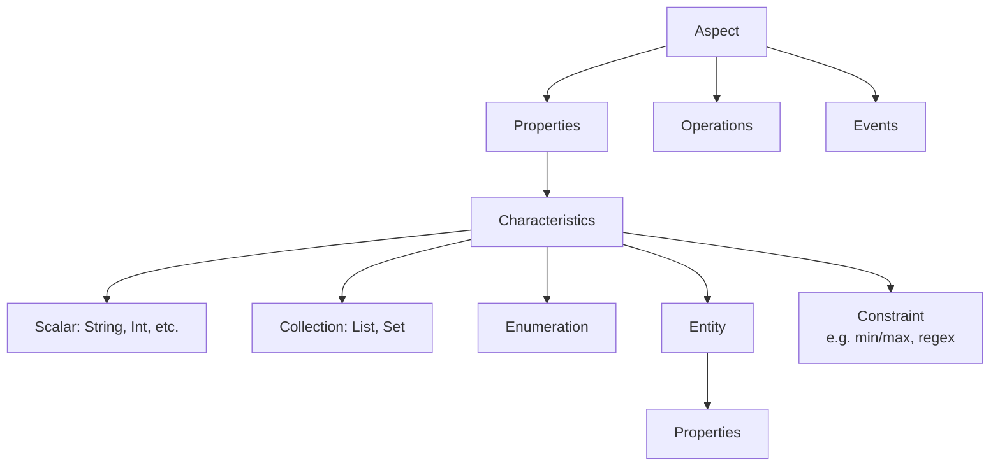
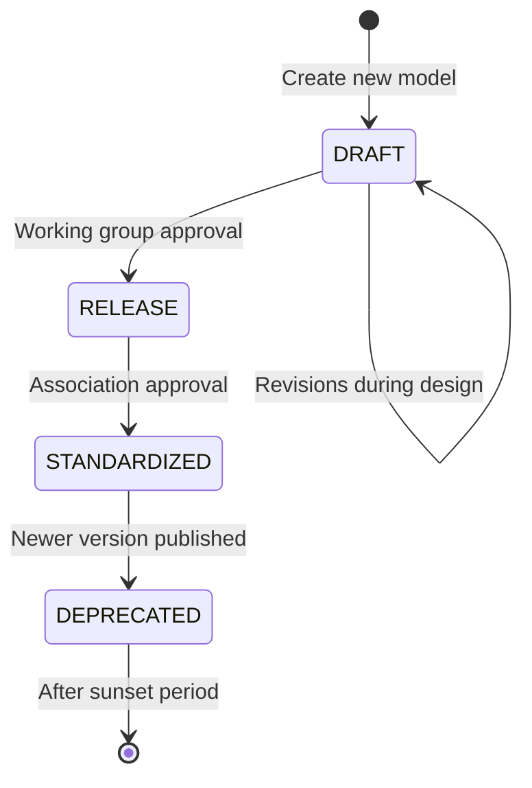

# Aspect Model Design Patterns in Catena-X

## Overview

**Aspect Models** are the foundational language for describing data structures in the Catena-X ecosystem. They define the semantics, structure, and constraints of data exchanged between participants — enabling true **semantic interoperability** across the supply chain.

:::info What You'll Learn

- What aspect models are and why they exist
- The SAMM (Semantic Aspect Meta Model) framework
- Key design patterns for aspect models
- How to work with existing models
- The relationship between aspect models and Digital Twins
- Lifecycle management of aspect models
:::

## What are Aspect Models?

An **Aspect Model** is a formal, machine-readable specification of a data payload — the "shape" of the data that a backend system exposes via the Catena-X data space.

```
Digital Twin (AAS)
└── Submodel (Aspect)
    └── Data payload described by → Aspect Model (SAMM)
```

**Key properties of aspect models:**

- **Versioned**: Each model has a semantic version (MAJOR.MINOR.PATCH)
- **Self-describing**: Models contain their own documentation
- **Strongly typed**: All properties have defined data types and constraints
- **Namespace-scoped**: Uniquely identified by namespace + model name + version
- **Machine-readable**: Can generate code, API specifications, and validators

:::tip Why Aspect Models?
Without a shared semantic model, `payload: { partId: 12345 }` could mean anything. With an aspect model, everyone knows that `catenaXId` is a UUIDv4 uniquely identifying a part instance in the Catena-X network — and this is enforced in the schema.
:::

## The SAMM Framework

Catena-X uses the **Semantic Aspect Meta Model (SAMM)** as the meta-model for all aspect models. SAMM provides the vocabulary and rules for constructing aspect models.

:::info Related Standard
**CX-0003** - SAMM Semantic Aspect Meta Model *(See [Standards](../../standards/overview))*
:::

### SAMM Building Blocks



| Element | Description |
|---|---|
| **Aspect** | The root element, represents the data payload |
| **Property** | A named attribute of an aspect or entity |
| **Characteristic** | The semantic type/shape of a property |
| **Entity** | A complex type composed of properties |
| **Enumeration** | A fixed set of allowed values |
| **Constraint** | Restrictions on values (min, max, regex, etc.) |
| **Trait** | Applies a constraint to a characteristic |

### Model Identifier Format

Every SAMM model is uniquely identified by a **URN**:

```
urn:samm:{namespace}:{version}#{ModelName}
```

**Examples:**

```
urn:samm:io.catenax.serial_part:3.0.0#SerialPart
urn:samm:io.catenax.batch:3.0.0#Batch
urn:samm:io.catenax.pcf:7.0.0#Pcf
```

The version follows **Semantic Versioning**:

- **MAJOR**: Breaking changes (incompatible with previous versions)
- **MINOR**: New features, backward compatible
- **PATCH**: Bug fixes, fully backward compatible

## Core Design Patterns

### Pattern 1: The CatenaX ID Pattern

Every Catena-X part/object has a globally unique identifier:

```turtle
:catenaXId a samm:Property ;
    samm:preferredName "Catena-X ID"@en ;
    samm:description "The Catena-X ID of the given part..."@en ;
    samm:characteristic :CatenaXIdTrait .

:CatenaXIdTrait a samm-c:Trait ;
    samm-c:baseCharacteristic :UUIDv4 ;
    samm-c:constraint :UUIDv4RegularExpression .

:UUIDv4RegularExpression a samm-c:RegularExpressionConstraint ;
    samm:value "^[0-9a-fA-F]{8}-[0-9a-fA-F]{4}-4..." .
```

**Implementation:** Every part instance aspect model begins with a `catenaXId` property — a UUIDv4 that serves as the Digital Twin's ID in the AAS registry.

### Pattern 2: Optional vs. Required Properties

Properties can be marked as optional to accommodate different data maturity levels:

```turtle
:optionalProperty a samm:Property ;
    samm:name "optionalProperty" ;
    samm:optional "true"^^xsd:boolean .
```

:::note Design Guidance
Use **optional properties** for data that:

- Is not always available in all supply chain positions
- Represents enrichment data that may be added later
- Has different availability for different part types (OEM vs. supplier)

Use **required properties** for data that:

- Is fundamental to the model's purpose
- Is always available if the model is applicable at all
- Is needed for cross-company use cases to function
:::

### Pattern 3: Enumeration for Standardized Values

Use enumerations when a property must be one of a fixed set of values:

```turtle
:PartTypeEnumeration a samm-c:Enumeration ;
    samm:dataType xsd:string ;
    samm-c:values (
        "component"
        "assembly"
        "rawMaterial"
        "software"
    ) .
```

**Examples in Catena-X:**

- Battery cell chemistry types
- Manufacturing country codes (ISO 3166-1 alpha-2)
- Unit of measurement codes (from ECLASS)

### Pattern 4: Versioned Relationships

Bill of Materials (BOM) aspects encode versioned parent-child relationships:

```json
{
  "catenaXId": "urn:uuid:parent-part-id",
  "childItems": [
    {
      "catenaXId": "urn:uuid:child-part-id",
      "quantity": {
        "quantityNumber": 1.0,
        "measurementUnit": "unit:piece"
      },
      "hasAlternatives": false,
      "createdOn": "2022-02-03T14:48:54.709Z",
      "lastModifiedOn": "2022-02-03T14:48:54.709Z",
      "businessPartner": "BPNL0000000000001"
    }
  ]
}
```

This is the **SingleLevelBomAsBuilt** pattern — connecting what was actually built to its actual children in the supply chain.

### Pattern 5: Measurement with Units

Quantities are always expressed with explicit units using the **Unit Catalog**:

```turtle
:QuantityCharacteristic a samm-c:SingleEntity ;
    samm:dataType :Quantity .

:Quantity a samm:Entity ;
    samm:properties (
        :quantityNumber
        :measurementUnit
    ) .

:quantityNumber a samm:Property ;
    samm:characteristic samm-c:Float .

:measurementUnit a samm:Property ;
    samm:characteristic :UnitReference .
```

**Example values:** `unit:kilogram`, `unit:piece`, `unit:litre`, `unit:kilowattHour`

## Key Catena-X Aspect Models

### Industry Core Models

| Model | Version | Purpose |
|---|---|---|
| `SerialPart` | 3.x | Serialized parts (individual instances) |
| `Batch` | 3.x | Batch-produced parts |
| `JustInSequencePart` | 3.x | JIS-specific production tracking |
| `SingleLevelBomAsBuilt` | 3.x | As-built Bill of Materials |
| `SingleLevelUsageAsBuilt` | 3.x | Where a part is used |
| `PartAsPlanned` | 2.x | Parts in the planning phase |
| `SingleLevelBomAsPlanned` | 3.x | Planned Bill of Materials |

### PCF Models

| Model | Version | Purpose |
|---|---|---|
| `Pcf` | 7.x | Product Carbon Footprint data |
| `PcfRequestMessage` | 2.x | PCF data request |

### Quality Models

| Model | Version | Purpose |
|---|---|---|
| `QualityTask` | 2.x | Quality investigation task |
| `FleetDiagnosticData` | 2.x | Vehicle fleet diagnostic data |
| `PartsAnalysis` | 2.x | Analysis results for parts |
| `ManufacturedPartsQualityInformation` | 2.x | Manufacturing quality data |

### Circular Economy Models

| Model | Version | Purpose |
|---|---|---|
| `Pcf` | 7.x | Product Carbon Footprint |
| `MaterialForRecycling` | 1.x | End-of-life material composition |
| `PartAsSpecified` | 3.x | Part specifications |
| `SingleLevelBomAsSpecified` | 2.x | Specification BOM |
| `BatteryPass` | 6.x | Digital Battery Pass |

## Semantic Model Lifecycle



### Versioning Rules

:::warning Breaking vs. Non-Breaking Changes
**Non-breaking (MINOR/PATCH):** Adding optional properties, adding new enumeration values (in some cases), fixing documentation

**Breaking (MAJOR):** Removing properties, changing property data types, renaming properties, changing from optional to required, changing namespace

A MAJOR version change means consumers must update their code. Plan for overlap periods where both versions are supported.
:::

### Compatibility Matrix

When a model publishes a new major version, data providers must:

1. Continue supporting old major version until the **sunset date**
2. Publish data in both old and new version (separate submodel entries)
3. Notify consumers about the migration timeline
4. Follow the standard's transition period (typically one release cycle)

## Finding and Using Models

### Semantic Hub

The **Semantic Hub** (operated by Tractus-X) is the official registry of all Catena-X aspect models. It provides:

- Model discovery and browsing
- Schema validation
- Example payloads
- Documentation generation

### Working with Models

**Validating a payload against a model:**

```python
# Using the SAMM SDK
from samm_cli import validate

result = validate(
    model_urn="urn:samm:io.catenax.serial_part:3.0.0#SerialPart",
    payload=payload_json
)
```

**Generating a JSON Schema:**

```bash
# Using samm-cli
samm aspect io.catenax.serial_part:3.0.0:SerialPart.ttl validate
samm aspect io.catenax.serial_part:3.0.0:SerialPart.ttl generate schema
```

## Design Guidelines

:::tip Best Practices for Model Design

1. **Reuse existing characteristics**: Use shared characteristics for common patterns (CatenaXId, BPN, etc.)
2. **Use ECLASS for units**: Reference standard unit codes from ECLASS where possible (see CX-0044)
3. **Namespace your models**: Use reverse domain notation: `io.catenax.{model_name}`
4. **Version carefully**: Think ahead — breaking changes are expensive for the ecosystem
5. **Document thoroughly**: Every property needs a `preferredName` and `description` in English
6. **Provide examples**: Include representative example payloads in the model documentation
7. **Keep it focused**: One model = one aspect. Don't create "kitchen sink" models
8. **Use optional wisely**: Required properties must always be available; be conservative
:::

## Related Standards

- **CX-0003** - SAMM Semantic Aspect Meta Model *(See [Standards](../../standards/overview))*
- **CX-0044** - ECLASS Standard *(See [Standards](../../standards/overview))*
- **CX-0045** - Aspect Model Data Chain Template *(See [Standards](../../standards/overview))*
- **CX-0002** - Digital Twins in Catena-X *(See [Standards](../../standards/overview))*

## References

- [Tractus-X Semantic Hub](https://semantics.int.demo.catena-x.net/)
- [SAMM Specification](https://eclipse-oss.github.io/esmf-semantic-model-editor/)
- [Catena-X Semantic Models](https://github.com/eclipse-tractusx/sldt-semantic-models)
- [ECLASS Standard](https://www.eclass.eu/)
- [Digital Twin Concepts](./digital-twin-concepts)

---

:::note Questions?
For questions about aspect model design and SAMM, consult the Semantic Modeling Expert Group or refer to CX-0003 in the [Standards](../../standards/overview).
:::
