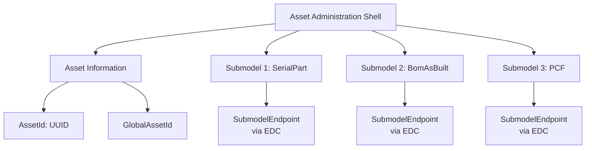
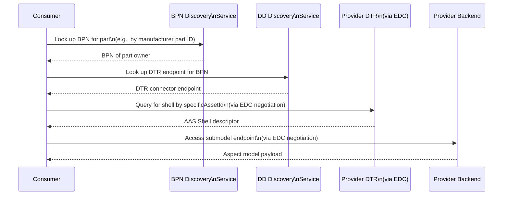
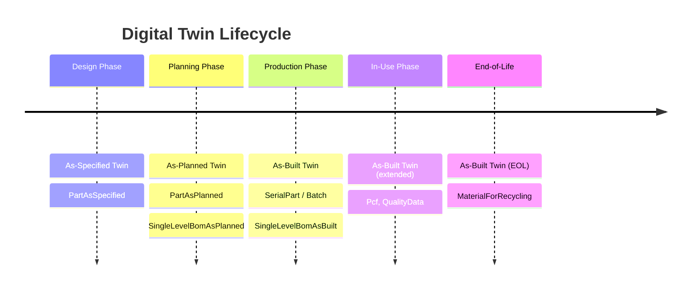

# Digital Twin Concepts in Catena-X

## Overview

**Digital Twins** are the mechanism by which physical objects and processes in the supply chain are represented and accessed digitally in Catena-X. They form the backbone of use cases like Traceability, PCF, Quality Management, and Circular Economy by providing a standardized way to discover, access, and exchange supply chain data.

:::info Related Standard
**CX-0002** - Digital Twins in Catena-X *(See [Standards](../../standards/overview))*
:::

:::info What You'll Learn

- What Digital Twins are in the Catena-X context
- The Asset Administration Shell (AAS) standard
- How the Digital Twin Registry works
- How Digital Twins connect to aspect models
- The look-up chain for finding a digital twin
- Twin types: as-built, as-planned, as-specified
:::

## What is a Digital Twin in Catena-X?

A Catena-X **Digital Twin** is a virtual representation of a physical object or process, accessible via standardized interfaces. It consists of:

1. **A unique identity** (CatenaX ID — a UUIDv4)
2. **Metadata** (registered in the Digital Twin Registry)
3. **Submodels** (aspect-specific data, described by Aspect Models, accessed via the connector)

```
Physical Part (Real World)
        ↕
Digital Twin (Catena-X)
├── Identity: urn:uuid:550e8400-e29b-41d4-a716-446655440000
├── [Submodel] SerialPart → EDC Connector → Backend API
├── [Submodel] SingleLevelBomAsBuilt → EDC Connector → Backend API
└── [Submodel] Pcf → EDC Connector → Backend API
```

:::tip One Object, Many Aspects
A single physical part can have multiple "aspects" — each describing a different view of the part. The SerialPart aspect tells you what the part is; the SingleLevelBomAsBuilt aspect tells you what it's made of; the Pcf aspect tells you its carbon footprint.
:::

## The Asset Administration Shell (AAS)

Catena-X uses the **Asset Administration Shell (AAS)** specification from the **Industrial Digital Twin Association (IDTA)** as the meta-model for Digital Twins.

### AAS Structure



| AAS Element | Description |
|---|---|
| **Shell** | The digital twin itself |
| **AssetId** | Reference to the physical asset |
| **GlobalAssetId** | Globally unique ID (UUIDv4 = CatenaXId) |
| **Submodel** | One aspect of the twin |
| **SubmodelEndpoint** | How to access the submodel data |

### Shell Registration Example

```json
{
  "id": "urn:uuid:550e8400-e29b-41d4-a716-446655440000",
  "globalAssetId": "urn:uuid:550e8400-e29b-41d4-a716-446655440000",
  "idShort": "Vehicle_VIN_12345678",
  "specificAssetIds": [
    {
      "name": "manufacturerPartId",
      "value": "XYZ-PART-12345",
      "externalSubjectId": {
        "type": "ExternalReference",
        "keys": [{"type": "GlobalReference", "value": "PUBLIC"}]
      }
    },
    {
      "name": "partInstanceId",
      "value": "SN-2024-00001",
      "externalSubjectId": {
        "type": "ExternalReference",
        "keys": [{"type": "GlobalReference",
          "value": "BPNL0000000000CONSUMER"}]
      }
    }
  ],
  "submodelDescriptors": [
    {
      "id": "urn:uuid:submodel-001",
      "semanticId": {
        "type": "ExternalReference",
        "keys": [{
          "type": "GlobalReference",
          "value": "urn:samm:io.catenax.serial_part:3.0.0#SerialPart"
        }]
      },
      "endpoints": [{
        "interface": "SUBMODEL-3.0",
        "protocolInformation": {
          "href": "https://edc.provider.example.com/api/v1/dsp",
          "endpointProtocol": "HTTP",
          "endpointProtocolVersion": ["1.1"],
          "subprotocol": "DSP",
          "subprotocolBody": "id=asset-edc-001;dspEndpoint=https://edc.provider.example.com/api/v1/dsp",
          "subprotocolBodyEncoding": "plain"
        }
      }]
    }
  ]
}
```

## The Digital Twin Registry (DTR)

The **Digital Twin Registry (DTR)** is the catalog of all digital twins. It is a decentralized registry — each Catena-X participant operates their own DTR, registering the twins they are responsible for.

:::note Decentralized Architecture
There is **no single central DTR** in Catena-X. Each participant manages their own registry. This is a key data sovereignty design decision: participants control access to metadata about their own twins.
:::

### DTR Access via EDC

The DTR itself is accessed through the EDC connector. It is registered as a special data asset:

```json
{
  "@id": "{{DTR_ASSET_ID}}",
  "properties": {
    "type": "data.core.digitalTwinRegistry",
    "description": "Digital Twin Registry",
    "contenttype": "application/json"
  },
  "dataAddress": {
    "type": "HttpData",
    "baseUrl": "https://my-dtr.example.com/api/v3"
  }
}
```

Consumers access the DTR using the purpose `cx.core.digitalTwinRegistry:1`.

## The Digital Twin Look-Up Chain

Finding a specific digital twin involves a standardized lookup sequence:



### Step 1: BPN Discovery

The **BPN Discovery Service** maps identifier types (e.g., manufacturer part IDs, vehicle identification numbers) to Business Partner Numbers.

```http
POST /api/v1.0/administration/connectors/bpnDiscovery/search
Content-Type: application/json

{
  "searchFilter": [
    {
      "type": "oen",
      "keys": ["OEN-1234567890"]
    }
  ]
}
```

Response: `BPNL0000000000SUPPLIER`

### Step 2: Connector Discovery (BDRS)

The **Business Partner Data Register Server (BDRS)** resolves a BPN to a connector endpoint URL.

### Step 3: DTR Query

Query the provider's DTR (via EDC) for the digital twin:

```http
GET /lookup/shells?assetIds=[{"name":"manufacturerPartId","value":"XYZ-PART-12345"}]
```

Response: List of `globalAssetId` values.

### Step 4: Shell Descriptor Retrieval

```http
GET /shell-descriptors/{aasId}
```

Returns the full AAS descriptor including submodel endpoints.

### Step 5: Submodel Access

Using the submodel endpoint from the descriptor, negotiate with the provider's EDC and access the submodel:

```http
GET /submodel
Authorization: Bearer {edc-transfer-token}
```

Response: The aspect model payload (e.g., SerialPart JSON).

## Twin Types

Catena-X supports multiple lifecycle phases, each with its own twin type:

### As-Built Twins

Represent the **actual manufactured product**:

- Created when a part is manufactured
- Uses serialization (individual part IDs)
- Key aspects: `SerialPart`, `SingleLevelBomAsBuilt`
- Linked to actual production data

### As-Planned Twins

Represent **planned/designed products**:

- Created during design and planning phases
- Can represent part types (not individual instances)
- Key aspects: `PartAsPlanned`, `SingleLevelBomAsPlanned`
- Used for demand planning and design collaboration

### As-Specified Twins

Represent **specification/design intent**:

- Created during product specification
- Key aspects: `PartAsSpecified`, `SingleLevelBomAsSpecified`
- Used for design verification



## specificAssetIds and Access Control

**specificAssetIds** are the key-value pairs used to look up twins. Their visibility is controlled:

| externalSubjectId | Visibility |
|---|---|
| `PUBLIC` | Visible to all without authentication |
| `BPNL0000000000XXX` | Visible only to that specific BPN |
| `BPNL000000000000` (own BPN) | Visible only to the owner |

:::warning Privacy Considerations
Be careful about which identifiers you mark as PUBLIC. Identifiers that reveal business relationships (e.g., customer-specific part IDs) should only be visible to the relevant business partner, not to the public.
:::

## Best Practices

:::tip For Data Providers

1. **Register all relevant specificAssetIds**: Make your twins discoverable via standard identifiers
2. **Set appropriate visibility**: Protect business-sensitive identifiers
3. **Keep submodel descriptors up to date**: Update endpoints if URLs change
4. **Support multiple aspect versions**: Maintain backward compatibility during transitions
5. **Use the globalAssetId consistently**: The same UUID should be used across all your systems
:::

:::tip For Data Consumers

1. **Cache twin registrations**: Avoid redundant registry lookups
2. **Handle twin not found gracefully**: Not all parts have digital twins yet
3. **Check semantic IDs**: Verify you are accessing the correct aspect version
4. **Follow the lookup chain**: Use BPN Discovery → BDRS → DTR, not shortcuts
:::

## Related Standards and Topics

- **CX-0002** - Digital Twins in Catena-X *(See [Standards](../../standards/overview))*
- **CX-0001** - Participant Agent Registration *(See [Standards](../../standards/overview))*
- [Aspect Model Design Patterns](./aspect-model-design) — How data is structured
- [Industry Core Use Case](../use-cases/industry-core) — Primary user of Digital Twins

## References

- [IDTA Asset Administration Shell Specification](https://industrialdigitaltwin.org/en/content-hub/aasspecifications)
- [Tractus-X Digital Twin Registry](https://github.com/eclipse-tractusx/sldt-digital-twin-registry)
- [Tractus-X Semantic Models](https://github.com/eclipse-tractusx/sldt-semantic-models)

---

:::note Questions?
For questions about Digital Twin implementation in Catena-X, consult CX-0002 in the [Standards](../../standards/overview).
:::
