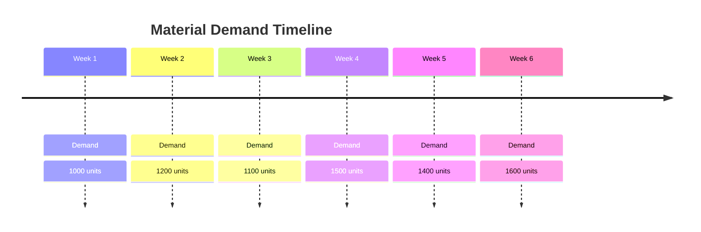
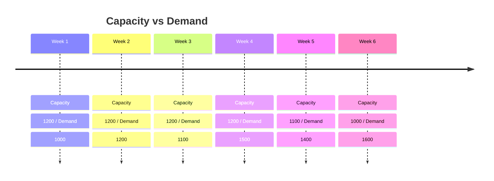
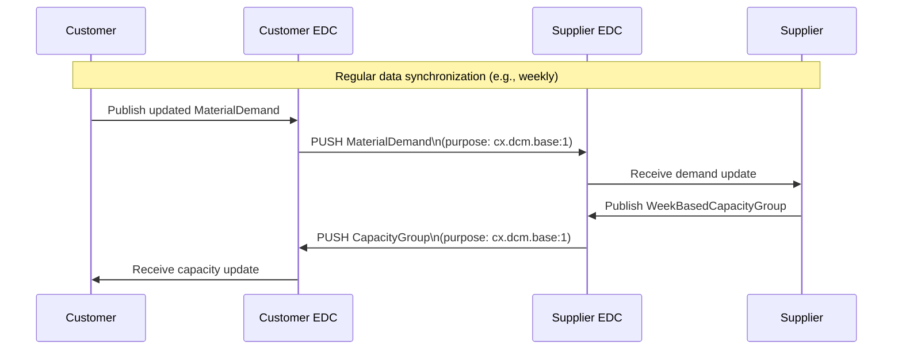
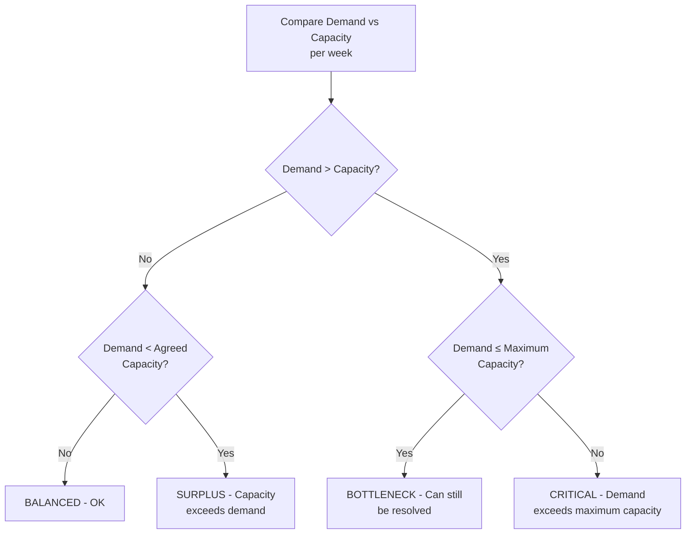
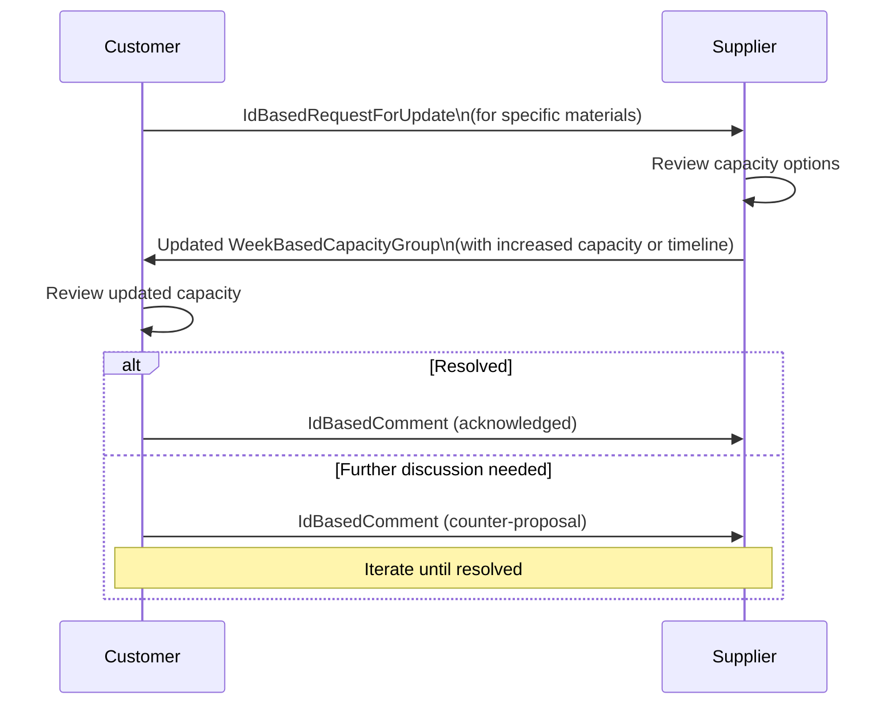
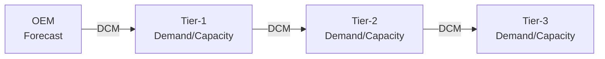

# Demand & Capacity Management (DCM) in Catena-X

## Overview

**Demand & Capacity Management (DCM)** is a Catena-X use case that enables collaborative supply chain planning by allowing customers and suppliers to exchange demand forecasts and capacity data in a standardized, automated way. DCM helps **prevent supply shortages, detect imbalances early, and initiate collaborative resolution** before they become production disruptions.

:::info Related Standard
**CX-0128** - Demand and Capacity Management Data Exchange *(See [Standards](../../standards/overview))*
:::

:::info What You'll Learn

- The business problem DCM solves
- The DCM data models (MaterialDemand, WeekBasedCapacityGroup)
- The demand/capacity comparison workflow
- Early warning indicators
- Collaborative resolution patterns
- Implementation requirements
:::

## The Business Problem

Supply chain disruptions — chip shortages, raw material scarcity, logistics failures — have shown that **poor visibility between supply chain tiers is extremely costly**. Today, most demand and capacity alignment happens through:

- **Manual processes**: Excel spreadsheets, emails, phone calls
- **Late detection**: Problems discovered only when production is already impacted
- **Point-to-point solutions**: Proprietary EDI connections that don't scale

DCM changes this by providing a **standardized, automated, digital channel** for demand/capacity exchange that works across the entire supply chain.

:::tip Tangible Benefits
Early detection of a capacity shortfall 8 weeks before the problem occurs allows time for:

- Capacity ramp-up at the supplier
- Alternative sourcing
- Customer production schedule adjustments
- Collaborative demand reprioritization

Detection 2 days before? Too late.
:::

## Core Concepts

### Material Demand (Customer Side)

The customer publishes their **material demand** — how many units of each material/part they need, week by week.



### Capacity Group (Supplier Side)

The supplier publishes their **capacity** — how many units they can produce per week for a specific material.



**Imbalances detected**: Weeks 4, 5, 6 (demand exceeds capacity)

## Data Models

### MaterialDemand

Published by the **customer** to their supplier:

```json
{
  "materialDemandId": "urn:uuid:demand-001",
  "demandSeries": [
    {
      "customerLocationId": "BPNS0000000000PLANT",
      "expectedSupplierLocationId": "BPNS0000000000SUPPLIER",
      "demandCategory": {
        "demandCategoryCode": "A1"
      },
      "demands": [
        {
          "demand": 1000.0,
          "pointInTime": "2024-04-01"
        },
        {
          "demand": 1200.0,
          "pointInTime": "2024-04-08"
        },
        {
          "demand": 1500.0,
          "pointInTime": "2024-04-15"
        }
      ]
    }
  ],
  "materialNumberCustomer": "CUSTOMER-MAT-12345",
  "materialNumberSupplier": "SUPPLIER-MAT-67890",
  "materialDescriptionCustomer": "Battery Module 50kWh",
  "unitOfMeasureIsOmitted": false,
  "unitOfMeasure": "unit:piece",
  "changedAt": "2024-01-15T10:30:00Z"
}
```

### WeekBasedCapacityGroup

Published by the **supplier** to their customer, linking materials to capacity:

```json
{
  "capacityGroupId": "urn:uuid:capacity-group-001",
  "capacityGroupIsInactive": false,
  "changedAt": "2024-01-15T10:30:00Z",
  "unitOfMeasure": "unit:piece",
  "linkedDemandSeries": [
    {
      "materialNumberCustomer": "CUSTOMER-MAT-12345",
      "materialNumberSupplier": "SUPPLIER-MAT-67890",
      "customerLocationId": "BPNS0000000000PLANT"
    }
  ],
  "supplierLocationsId": ["BPNS0000000000SUPPLIER"],
  "name": "Battery Module Production Line A",
  "customerBpnl": "BPNL0000000000CUSTOMER",
  "supplierBpnl": "BPNL0000000000SUPPLIER",
  "capacities": [
    {
      "pointInTime": "2024-04-01",
      "actualCapacity": 1200.0,
      "maximumCapacity": 1400.0,
      "agreedCapacity": 1000.0
    },
    {
      "pointInTime": "2024-04-08",
      "actualCapacity": 1200.0,
      "maximumCapacity": 1400.0,
      "agreedCapacity": 1100.0
    },
    {
      "pointInTime": "2024-04-15",
      "actualCapacity": 1200.0,
      "maximumCapacity": 1400.0,
      "agreedCapacity": 1200.0
    }
  ]
}
```

**Capacity Types:**

| Field | Description |
|---|---|
| `actualCapacity` | Current planned production capacity |
| `maximumCapacity` | Maximum achievable with extra resources |
| `agreedCapacity` | Contractually agreed capacity |

## DCM Interaction Flow

### Phase 1: Data Exchange



### Phase 2: Imbalance Detection



**Imbalance Classification:**

| Status | Condition | Action Required |
|---|---|---|
| ✅ **BALANCED** | Demand within actual capacity | No action |
| ⚠️ **SURPLUS** | Demand below agreed capacity | Discuss demand reduction |
| 🟡 **BOTTLENECK** | Demand > actual but ≤ maximum | Ramp up capacity |
| 🔴 **CRITICAL** | Demand > maximum capacity | Urgent escalation |

### Phase 3: Collaborative Resolution

When imbalances are detected, DCM supports collaborative resolution:



### IdBasedRequestForUpdate

A targeted request to refresh data for specific items:

```json
{
  "header": {
    "messageId": "urn:uuid:request-001",
    "senderBpn": "BPNL0000000000CUSTOMER",
    "receiverBpn": "BPNL0000000000SUPPLIER",
    "context": "CX-DCM-IdBasedRequestForUpdate",
    "sentDateTime": "2024-01-15T10:30:00Z"
  },
  "payload": {
    "weekBasedCapacityGroups": [
      {
        "capacityGroupId": "urn:uuid:capacity-group-001"
      }
    ]
  }
}
```

### IdBasedComment

Structured communication about specific capacity groups or demands:

```json
{
  "header": {
    "messageId": "urn:uuid:comment-001",
    "senderBpn": "BPNL0000000000CUSTOMER",
    "receiverBpn": "BPNL0000000000SUPPLIER",
    "context": "CX-DCM-IdBasedComment",
    "sentDateTime": "2024-01-15T10:30:00Z"
  },
  "payload": {
    "commentId": "urn:uuid:comment-001",
    "objectId": "urn:uuid:capacity-group-001",
    "objectType": "urn:samm:io.catenax.week_based_capacity_group",
    "author": "jane.doe@customer.example.com",
    "postedAt": "2024-01-15T10:30:00Z",
    "requestDelete": false,
    "listOfReferenceDates": ["2024-04-15"],
    "changedAt": "2024-01-15T10:30:00Z",
    "commentText": "Critical bottleneck in Week 3 of April. Can we increase capacity from 1200 to 1500?"
  }
}
```

## Demand Categories

DCM supports different demand categories that represent different planning horizons:

| Code | Category | Description |
|---|---|---|
| `A1` | Default | Normal demand planning |
| `A2` | After-Sales | Spare parts demand |
| `A3` | Series | Production series demand |
| `A4` | Phase-Out | Parts being phased out |
| `SR` | Safety Requirement | Regulatory/safety stock |

## Multi-Tier DCM

DCM can propagate through multiple supply chain tiers:



Each tier:

1. **Receives** customer demand
2. **Generates** their own demand to their sub-suppliers
3. **Publishes** capacity to their customer

This creates a **demand signal propagation** across the supply chain that can detect tier-N impacts early.

## Policy Requirements

DCM data exchange uses the purpose `cx.dcm.base:1`:

```json
{
  "permission": [{
    "action": "use",
    "constraint": {
      "and": [
        {
          "leftOperand": "cx-policy:Membership",
          "operator": "eq",
          "rightOperand": "active"
        },
        {
          "leftOperand": "cx-policy:UsagePurpose",
          "operator": "eq",
          "rightOperand": "cx.dcm.base:1"
        }
      ]
    }
  }]
}
```

## Implementation Checklist

:::tip Data Provider (Supplier) Checklist

- [ ] Implement WeekBasedCapacityGroup API
- [ ] Implement demand ingestion (receive MaterialDemand)
- [ ] Implement capacity-demand comparison logic
- [ ] Configure EDC asset + policy (cx.dcm.base:1)
- [ ] Set up push mechanism for capacity updates
- [ ] Implement IdBasedRequestForUpdate handler
- [ ] Implement IdBasedComment exchange
:::

:::tip Data Consumer (Customer) Checklist

- [ ] Implement MaterialDemand publishing
- [ ] Set up endpoint to receive capacity data
- [ ] Implement imbalance detection algorithm
- [ ] Implement IdBasedRequestForUpdate sending
- [ ] Implement comment/resolution workflow
- [ ] Set up monitoring and alerting for imbalances
:::

## Related Use Cases and Standards

- [Industry Core](./industry-core) — Part identification for demand linking
- [ODRL Policy Framework](../data-sovereignty/odrl-policy-framework) — `cx.dcm.base:1` purpose
- **CX-0118** - Actual Delivery Information Exchange *(See [Standards](../../standards/overview))*
- **CX-0145** - Days of Supply Exchange *(See [Standards](../../standards/overview))*
- **CX-0121** - Planned Production Output Exchange *(See [Standards](../../standards/overview))*

## References

- [CX-0128 Demand and Capacity Management Standard](../../standards/overview)
- [Tractus-X DCM Reference App](https://github.com/eclipse-tractusx/demand-capacity-mgmt)

---

:::note Questions?
For questions about DCM implementation, consult CX-0128 in the [Standards](../../standards/overview) or the Supply Chain Working Group.
:::
