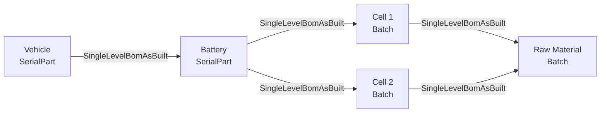
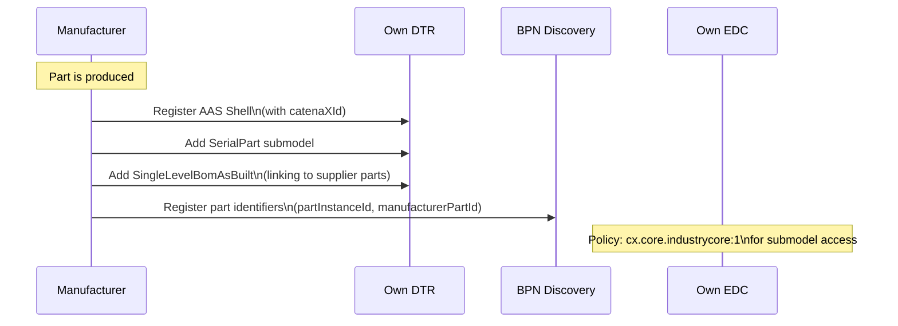
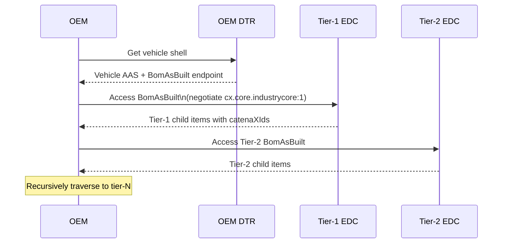

# Industry Core Use Case

## Overview

The **Industry Core** is the foundational use case in Catena-X — it establishes the **digital representation of the automotive supply chain**. By enabling a component-specific, end-to-end data exchange from raw material to finished vehicle, it unlocks all other Catena-X use cases that need to trace parts, exchange quality data, or track carbon footprints.

:::info Related Standards

- **CX-0127** - Industry Core Part Instance *(See [Standards](../../standards/overview))*
- **CX-0045** - Aspect Model Data Chain Template *(See [Standards](../../standards/overview))*
:::

:::info What You'll Learn

- The business problem Industry Core solves
- The data models that make it work
- The as-built and as-planned data flows
- How the supply chain graph is constructed
- Implementation patterns and requirements
:::

## The Business Problem

The automotive supply chain is complex — a single vehicle may contain tens of thousands of unique parts from hundreds of suppliers spanning many tiers. Without a standardized digital representation, answering questions like these is extremely difficult:

- "Which vehicles contain parts from the affected batch?"
- "What is the carbon footprint of this part's supply chain?"
- "Where did the raw materials in this battery come from?"
- "Is there a recall that affects any of my vehicles?"

Industry Core solves this by creating a **digital supply chain graph** where every part instance is connected to its parent and children through standardized, traversable digital links.

:::tip The Foundation for Everything
Industry Core is the **prerequisite** for most other Catena-X use cases. Without the digital supply chain graph, you cannot do traceability, quality notifications, PCF propagation, or digital product passes.
:::

## Core Concept: The Part Chain



Each arrow represents a data exchange between participants:

- **OEM** maintains: Vehicle → Battery link
- **Battery manufacturer** maintains: Battery → Cell links
- **Cell manufacturer** maintains: Cell → Raw material links

No participant has visibility beyond their direct business relationships — **data sovereignty is maintained at every tier**.

## Aspect Models

### SerialPart

Represents a **uniquely serialized part** — one physical instance.

```json
{
  "catenaXId": "urn:uuid:550e8400-e29b-41d4-a716-446655440000",
  "localIdentifiers": [
    {
      "key": "manufacturerPartId",
      "value": "MAN-PART-12345"
    },
    {
      "key": "partInstanceId",
      "value": "SN-2024-000001"
    }
  ],
  "manufacturingInformation": {
    "date": "2024-01-15T10:30:00Z",
    "country": "DEU",
    "sites": [
      {
        "catenaXsiteId": "BPNS0000000000001",
        "function": "production"
      }
    ]
  },
  "partTypeInformation": {
    "manufacturerPartId": "MAN-PART-12345",
    "nameAtManufacturer": "High Voltage Battery Module",
    "partClassification": [
      {
        "classificationStandard": "GIN 20510-21513",
        "classificationID": "1004711",
        "classificationDescription": "Battery Module"
      }
    ]
  }
}
```

### Batch

Represents parts produced in a **batch** (group without individual serialization):

```json
{
  "catenaXId": "urn:uuid:batch-001",
  "localIdentifiers": [
    {
      "key": "batchId",
      "value": "BATCH-2024-001"
    }
  ],
  "manufacturingInformation": {
    "date": "2024-01-15T00:00:00Z",
    "country": "DEU"
  },
  "partTypeInformation": {
    "manufacturerPartId": "CELL-TYPE-A",
    "nameAtManufacturer": "NMC Battery Cell 50Ah",
    "partClassification": []
  }
}
```

### SingleLevelBomAsBuilt

Connects a **parent part** to its **actual children** (as-built Bill of Materials):

```json
{
  "catenaXId": "urn:uuid:parent-part-id",
  "childItems": [
    {
      "catenaXId": "urn:uuid:child-part-id",
      "quantity": {
        "quantityNumber": 1.0,
        "measurementUnit": "unit:piece"
      },
      "hasAlternatives": false,
      "createdOn": "2024-01-15T14:48:54.709Z",
      "lastModifiedOn": "2024-01-15T14:48:54.709Z",
      "businessPartner": "BPNL0000000000SUPPLIER"
    }
  ]
}
```

### SingleLevelUsageAsBuilt

The **reverse link** — answers "where is this part used?":

```json
{
  "catenaXId": "urn:uuid:child-part-id",
  "customers": [
    {
      "parentItems": [
        {
          "catenaXId": "urn:uuid:parent-part-id",
          "quantity": {
            "quantityNumber": 1.0,
            "measurementUnit": "unit:piece"
          },
          "createdOn": "2024-01-15T14:48:54.709Z",
          "lastModifiedOn": "2024-01-15T14:48:54.709Z",
          "isOnlyPotentialParent": false
        }
      ],
      "businessPartner": "BPNL0000000000CUSTOMER",
      "createdOn": "2024-01-15T14:48:54.709Z",
      "lastModifiedOn": "2024-01-15T14:48:54.709Z"
    }
  ]
}
```

## Data Exchange Flow

### Registering a Part in the Chain



### Traversing the Chain (Upstream)

When an OEM needs to identify all tier-N parts in a vehicle:



### Unique ID Push

When a supplier ships a part to a customer, they proactively notify the customer of the catenaXId via the **Unique ID Push API**:

```json
{
  "header": {
    "messageId": "urn:uuid:message-001",
    "context": "urn:bamm:io.catenax.shared.message_header:2.0.0",
    "version": "2.0.0",
    "senderBpn": "BPNL0000000000SUPPLIER",
    "receiverBpn": "BPNL0000000000OEM",
    "sentDateTime": "2024-01-15T10:30:00Z",
    "ttl": "P1D"
  },
  "payload": {
    "listOfItems": [
      {
        "localIdentifiers": [
          {
            "key": "manufacturerPartId",
            "value": "MAN-PART-12345"
          },
          {
            "key": "partInstanceId",
            "value": "SN-2024-000001"
          }
        ],
        "catenaXId": "urn:uuid:550e8400-e29b-41d4-a716-446655440000"
      }
    ]
  }
}
```

## As-Planned Data Flow

In addition to as-built (actual production), Industry Core supports **as-planned** data for forward-looking supply chain visibility:

| Aspect | Purpose |
|---|---|
| `PartAsPlanned` | Planned part type information |
| `SingleLevelBomAsPlanned` | Planned BOM structure |
| `PartSiteInformationAsPlanned` | Where a part type will be produced |
| `SingleLevelUsageAsPlanned` | Where a planned part type will be used |

As-planned twins are created during **product planning** and enable demand/capacity planning and early supply chain risk identification.

## Implementation Checklist

For organizations implementing Industry Core:

:::tip Data Provider Checklist

- [ ] Assign catenaXIds (UUIDv4) to all serialized parts and batches
- [ ] Register AAS shells in your DTR for each part
- [ ] Implement SerialPart/Batch submodel API
- [ ] Implement SingleLevelBomAsBuilt submodel API
- [ ] Register part identifiers in BPN Discovery Service
- [ ] Implement Unique ID Push notification to customers
- [ ] Configure EDC asset + policy (cx.core.industrycore:1)
- [ ] Test with Tractus-X reference app
:::

:::tip Data Consumer Checklist

- [ ] Implement BPN Discovery lookup
- [ ] Implement BDRS/EDC endpoint resolution
- [ ] Implement DTR query via EDC
- [ ] Implement submodel access via EDC
- [ ] Handle chain traversal (recursive lookup)
- [ ] Handle "part not found" gracefully
:::

## Relationship to Other Use Cases

Industry Core is the **dependency** for:

| Use Case | How it uses Industry Core |
|---|---|
| **Traceability** | Uses part chain to identify affected parts in a recall |
| **PCF** | Traverses chain to aggregate carbon footprints |
| **Digital Product Pass** | Accesses part history via digital twin chain |
| **Quality Management** | Identifies affected parts in quality events |
| **Circular Economy** | Tracks material composition through the chain |

## References

- [CX-0127 Industry Core Part Instance Standard](../../standards/overview)
- [CX-0045 Aspect Model Data Chain Template](../../standards/overview)
- [Digital Twin Concepts](../semantic-interoperability/digital-twin-concepts)
- [Aspect Model Design Patterns](../semantic-interoperability/aspect-model-design)

---

:::note Questions?
For questions about Industry Core implementation, consult CX-0127 in the [Standards](../../standards/overview) or the Industry Core Working Group.
:::
