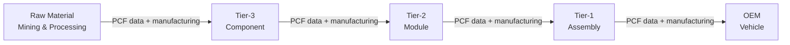
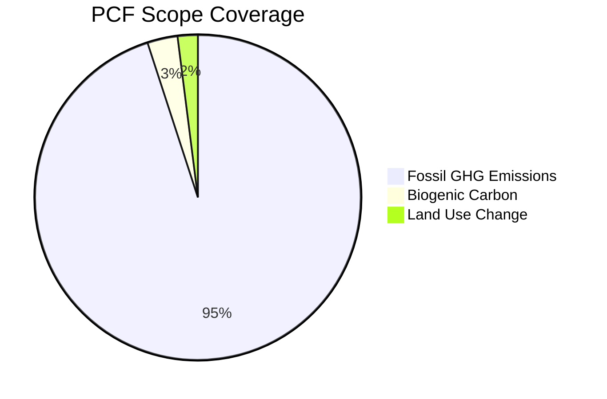
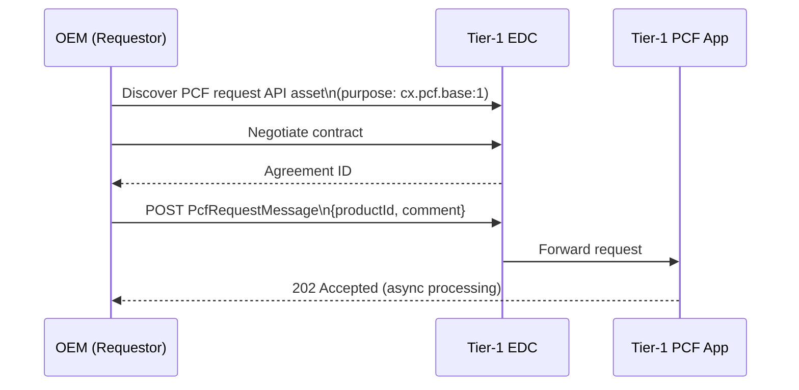
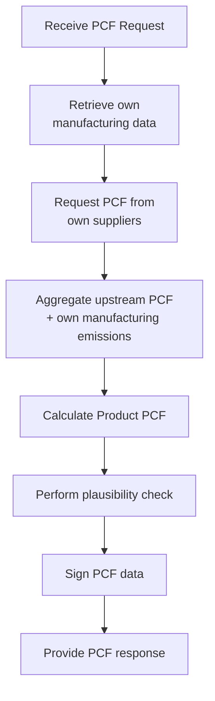
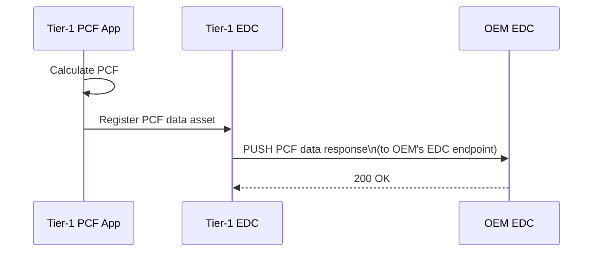
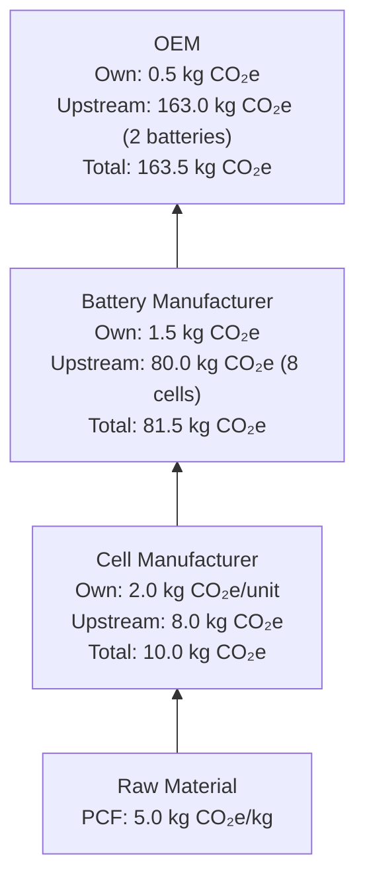

# Product Carbon Footprint (PCF) in Catena-X

## Overview

The **Product Carbon Footprint (PCF)** use case enables automotive supply chain participants to exchange standardized carbon footprint data for parts and products. This is a key enabler for companies to meet their **Scope 3 emission reduction targets** and comply with emerging regulations like the EU Battery Regulation and the Corporate Sustainability Reporting Directive (CSRD).

:::info What You'll Learn

- What PCF data is and why it matters
- The PCF data model and aspect
- The PCF exchange workflow
- How PCF aggregates across supply chain tiers
- Regulatory context and compliance
- Implementation requirements
:::

## Why PCF in the Supply Chain?

For a car manufacturer (OEM), up to **95% of emissions** are **Scope 3** — meaning they come from the supply chain, not from the OEM's own operations. Without supplier data, OEMs cannot accurately measure or reduce their total carbon footprint.



:::tip Regulatory Driver
The **EU Battery Regulation (2023/1542)** requires battery manufacturers to report Product Carbon Footprints for batteries. Catena-X PCF provides the technical mechanism for collecting this data across supply chain tiers.
:::

## The PCF Data Model

Catena-X PCF data follows the **Pathfinder Framework** specification (WBCSD/PACT) and is standardized in the `Pcf` aspect model.

### Key PCF Properties

```json
{
  "id": "urn:uuid:pcf-data-001",
  "specVersion": "2.0.1-20230314",
  "version": 1,
  "created": "2024-01-15T10:30:00Z",
  "status": "Active",
  "companyName": "Tier-1 Supplier GmbH",
  "companyIds": [
    "urn:uuid:company-id"
  ],
  "productDescription": "High Voltage Battery Module NMC 50kWh",
  "productIds": [
    "urn:uuid:550e8400-e29b-41d4-a716-446655440000"
  ],
  "productCategoryCpc": "3510",
  "productNameCompany": "HV Battery Module Type A",
  "comment": "Calculated using primary data for 80% of inputs",
  "pcf": {
    "declaredUnit": "kilogram",
    "unitaryProductAmount": 1.0,
    "pCfExcludingBiogenic": 12.5,
    "pCfIncludingBiogenic": 12.3,
    "fossilGhgEmissions": 12.1,
    "fossilCarbonContent": 3.2,
    "biogenicCarbonContent": 0.0,
    "characterizationFactors": "AR6",
    "crossSectoralStandardsUsed": [
      {
        "crossSectoralStandard": "GHG Protocol Product standard"
      }
    ],
    "productOrSectorSpecificRules": [
      {
        "operator": "EPD International",
        "ruleNames": ["General Programme Instructions v4.0"],
        "otherOperatorName": "EPD International"
      }
    ],
    "boundaryProcessesDescription": "Cradle-to-gate...",
    "referencePeriodStart": "2023-01-01T00:00:00Z",
    "referencePeriodEnd": "2023-12-31T23:59:59Z",
    "geographyCountrySubdivision": "DE",
    "primaryDataShare": 56.12,
    "dataQualityRating": {
      "coveragePercent": 80,
      "technologicalDQR": 2.0,
      "temporalDQR": 2.0,
      "geographicalDQR": 1.5,
      "completenessPercent": 92.5,
      "reliability": 2.0
    },
    "exemptedEmissionsPercent": 3.5,
    "exemptedEmissionsDescription": "...",
    "packagingEmissionsIncluded": true
  }
}
```

### Key Emission Metrics

| Field | Description | Unit |
|---|---|---|
| `pCfExcludingBiogenic` | Product carbon footprint (excl. biogenic) | kg CO₂e / declared unit |
| `pCfIncludingBiogenic` | PCF including biogenic emissions | kg CO₂e / declared unit |
| `fossilGhgEmissions` | GHG from fossil sources | kg CO₂e / declared unit |
| `primaryDataShare` | Percentage from primary (measured) data | % |
| `dataQualityRating` | Data quality indicators | Various |

### Emission Categories



The PCF aspect covers:

- **Cradle-to-gate** emissions (raw material to factory gate)
- Both **fossil** and **biogenic** carbon
- Packaging emissions (if included)
- Distribution emissions (optionally)

## PCF Exchange Workflow

### Step 1: PCF Request

A data consumer (e.g., OEM) requests PCF data from a supplier:



**PCF Request Message:**

```json
{
  "header": {
    "messageId": "urn:uuid:req-001",
    "context": "CX-PCF-Request",
    "version": "2.0.0",
    "senderBpn": "BPNL0000000000OEM",
    "receiverBpn": "BPNL0000000000T1",
    "sentDateTime": "2024-01-15T10:30:00Z",
    "ttl": "P7D"
  },
  "payload": {
    "requestId": "urn:uuid:req-001",
    "productId": "urn:uuid:product-id",
    "comment": "Required for 2024 vehicle model PCF report"
  }
}
```

### Step 2: PCF Calculation at Supplier

The supplier calculates the PCF for the requested product, potentially requesting PCF data from their own suppliers (Tier-2, Tier-3):



### Step 3: PCF Response

The supplier provides the PCF data back to the requestor:



**PCF Response Message:**

```json
{
  "header": {
    "messageId": "urn:uuid:resp-001",
    "context": "CX-PCF-Response",
    "requestId": "urn:uuid:req-001",
    "senderBpn": "BPNL0000000000T1",
    "receiverBpn": "BPNL0000000000OEM",
    "sentDateTime": "2024-01-15T14:30:00Z"
  },
  "payload": {
    "requestId": "urn:uuid:req-001",
    "productId": "urn:uuid:product-id",
    "pcf": {
      "...": "PCF data object (see above)"
    }
  }
}
```

## PCF Aggregation Across Tiers

The key value proposition of Catena-X PCF is **supply chain propagation**:



Each tier:

1. **Receives** upstream PCF data from suppliers
2. **Adds** their own manufacturing emission contribution
3. **Calculates** the aggregated PCF for their product
4. **Provides** the result to their customer

## Data Quality and Primary Data

### Primary vs. Secondary Data

| Data Type | Definition | Impact on Quality |
|---|---|---|
| **Primary data** | Measured/metered at the specific facility | High quality, 100% relevant |
| **Secondary data** | Industry averages, databases (e.g., ecoinvent) | Lower quality, less specific |

The `primaryDataShare` field in the PCF model indicates what percentage of the emission data is based on primary data.

### Data Quality Rating (DQR)

The DQR score (1-3, lower is better) assesses data quality across dimensions:

| Dimension | Description |
|---|---|
| **Technological** | How representative is the data of your technology? |
| **Temporal** | How recent is the data? |
| **Geographical** | How location-specific is the data? |
| **Completeness** | What percentage of actual emissions is covered? |
| **Reliability** | How reliable is the measurement method? |

:::info Data Quality Trajectory
Companies start with secondary data (industry averages) and progressively replace it with primary data (actual measurements) to improve PCF accuracy. Catena-X accommodates both approaches.
:::

## Regulatory Context

### EU Battery Regulation

The **EU Battery Regulation (2023/1542)** requires:

- PCF declarations for EV batteries placed on the EU market
- Battery passport including PCF data
- Verification by accredited third parties

Catena-X PCF directly supports compliance by:

- Providing standardized PCF data exchange
- Enabling multi-tier PCF aggregation
- Supporting the Digital Battery Pass aspect model

### CSRD and Double Materiality

The **Corporate Sustainability Reporting Directive (CSRD)** requires large companies to report Scope 3 emissions. PCF data from suppliers contributes to accurate Scope 3 Category 1 (purchased goods and services) reporting.

## Policy Requirements

To exchange PCF data, use the policy purpose `cx.pcf.base:1`:

```json
{
  "permission": [{
    "action": "use",
    "constraint": {
      "and": [
        {
          "leftOperand": "cx-policy:Membership",
          "operator": "eq",
          "rightOperand": "active"
        },
        {
          "leftOperand": "cx-policy:UsagePurpose",
          "operator": "eq",
          "rightOperand": "cx.pcf.base:1"
        }
      ]
    }
  }]
}
```

## Implementation Checklist

:::tip PCF Provider Checklist

- [ ] Implement PCF calculation methodology (per Pathfinder Framework)
- [ ] Collect primary data from manufacturing operations
- [ ] Request upstream PCF from your own suppliers
- [ ] Implement PCF aspect model API
- [ ] Register PCF assets in EDC with `cx.pcf.base:1` policy
- [ ] Implement PCF Request message handling
- [ ] Implement PCF Response push mechanism
:::

:::tip PCF Consumer Checklist

- [ ] Implement PCF request workflow
- [ ] Set up endpoint to receive PCF push responses
- [ ] Implement PCF aggregation logic
- [ ] Store PCF data for reporting purposes
- [ ] Validate PCF data against schema
:::

## Related Topics and Standards

- [Industry Core Use Case](./industry-core) — Part identification for PCF requests
- [ODRL Policy Framework](../data-sovereignty/odrl-policy-framework) — `cx.pcf.base:1` purpose
- [Digital Twin Concepts](../semantic-interoperability/digital-twin-concepts) — PCF aspect in Digital Twin

## References

- [WBCSD Pathfinder Framework](https://pathfinderframework.org/)
- [EU Battery Regulation](https://eur-lex.europa.eu/legal-content/EN/TXT/?uri=CELEX%3A32023R1542)
- [Tractus-X PCF Exchange App](https://github.com/eclipse-tractusx/digital-product-pass)

---

:::note Questions?
For questions about PCF implementation in Catena-X, consult the PCF Working Group or refer to the PCF-related standards.
:::
