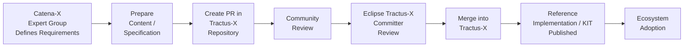

This page describes how Catena-X association members — including Expert Groups and Committees — contribute content to Eclipse Tractus-X. Following this process correctly ensures that content is reviewed, merged, and published in a way that meets both Catena-X quality standards and Eclipse Foundation governance requirements.

:::info[Who This Is For]
This guide is relevant for:

- **Expert Group members** who author KIT content or technical specifications
- **Committee members** who review and prioritize contributions
- **Association members** who wish to contribute to Tractus-X reference implementations

:::

## The End-to-End Flow

## Step-by-Step Guide

### Step 1: Define Requirements & Scope in Catena-X

Before contributing to Tractus-X, the work must be defined and aligned within Catena-X governance:

- The **Expert Group** develops the specification, standard candidate, or KIT content.
- The **Committee** reviews the content and confirms it is ready for implementation.
- The work is linked to a **Catena-X roadmap item** if applicable.

:::tip[Timing]
Plan this step well in advance. Tractus-X releases follow a fixed schedule. Initial pull requests must be submitted at least **4 weeks before the release date** to allow sufficient review time.
:::

### Step 2: Announce in Open Planning

All planned work in Tractus-X must be announced in the Tractus-X Open Planning process:

1. Create a **feature proposal issue** in the relevant Tractus-X repository.
2. The proposal must meet minimum content requirements (detailed specification, clear objectives, and a comprehensive plan).
3. Participate in **Open Planning meetings** to refine and prioritize the proposal.
4. Link the proposal to the relevant Catena-X roadmap item.

:::note
Open Planning meetings are communicated via the [Tractus-X News Page](https://eclipse-tractusx.github.io/blog/) and the [Tractus-X mailing list](https://accounts.eclipse.org/mailing-list/tractusx-dev).
:::

### Step 3: Prepare and Submit the Pull Request

Once the feature is approved in Open Planning, prepare the contribution:

1. **Fork** or work in the relevant Tractus-X repository.
2. Prepare the content — code, documentation, KIT files — following the [Tractus-X Release Guidelines](https://eclipse-tractusx.github.io/docs/getting-started/).
3. Ensure all automated checks pass (GitHub workflows: dependency checks, linting, security scans).
4. **Submit a pull request (PR)** targeting the correct release branch.

:::warning[Quality Gate]
All GitHub workflows must pass before a PR can be reviewed by Committers. Fix any failing checks before requesting a review.
:::

### Step 4: Community and Committer Review

After submission, the PR goes through a two-stage review:

| Stage | Reviewer | Purpose |
| --- | --- | --- |
| **Community review** | Any contributor | Technical quality, alignment with use cases, documentation completeness |
| **Committer review** | Eclipse Tractus-X Committers | Final authority; ensures compliance with Eclipse governance, code quality, and Tractus-X standards |

- Reviewers (including Committees and Senior Experts from Catena-X) provide feedback within **2 weeks**.
- The contributor addresses all feedback and updates the PR.
- Once approved, the Committer merges the PR.

:::warning[NOTE]
Eclipse Tractus-X Committers have final decision authority. No Catena-X body — including the Management Board or Committees — can override a Committer's decision on whether a PR is merged.
:::

### Step 5: Release & Publication

After merging, the contribution becomes part of the next Tractus-X release:

1. The Tractus-X release process consolidates all merged contributions.
2. A **feature freeze** marks the cutoff point; no new content is accepted after this.
3. Integration and end-to-end testing verify the release quality.
4. The release is **published** and made available to the ecosystem.

## Timing and Release Schedule

Tractus-X follows a structured release schedule. Key milestones for contributors:

| Milestone | Requirement |
| --- | --- |
| Feature proposal | Must be announced in Open Planning before development starts |
| Initial PR submission | At least 4 weeks before the release date |
| Reviewer feedback | Provided within 2 weeks of PR submission |
| Final PR | All feedback addressed and approved before release freeze |
| Feature freeze | No new content accepted after this point |

:::tip[Stay Informed]
Follow the [Tractus-X News Page](https://eclipse-tractusx.github.io/blog/) and subscribe to the [mailing list](https://accounts.eclipse.org/mailing-list/tractusx-dev) to stay informed about release dates and planning meetings.
:::

## Getting Access to Tractus-X Repositories

- Any GitHub user can fork a Tractus-X repository and submit a pull request — no special access is required.
- For repository write access (for planning purposes), follow the [Getting Started Guide](https://eclipse-tractusx.github.io/docs/getting-started/).
- To become a **Committer**, contribute consistently over time; Committer status is granted by the existing Committers based on merit.

## FAQs

**Can anyone propose a feature for Tractus-X?**
Yes. Anyone — including Committees, Expert Groups, and community members — can create a feature proposal. A dedicated feature author is required for each proposal.

**Who resolves conflicts between planned contributions from different teams?**
Dependencies and conflicts are discussed in Open Planning meetings and via communication channels (Matrix chat, mailing list).

**What happens if a PR is rejected by a Committer?**
The contributor should address the feedback and resubmit. If there is a fundamental disagreement, the matter can be discussed in the Tractus-X community forum or mailing list.

**Does Catena-X have a dedicated team contributing to Tractus-X?**
Contributions are made by association members (individuals at member companies). The association facilitates alignment and planning but does not maintain a dedicated development team. See [Responsibilities](./responsibilities.md) for details.

## Further Reading

- [Overview](./tractus-x-overview.md) — the three-layer model
- [Governance Model](./governance-model.md) — how both governance systems work
- [Responsibilities](./responsibilities.md) — who owns reference implementations and KITs
- [Funding & Resources](./funding.md) — where the money and engineering capacity come from
- [Tractus-X Release Process](../process-structure/process-tractus-x.md) — detailed release process documentation
