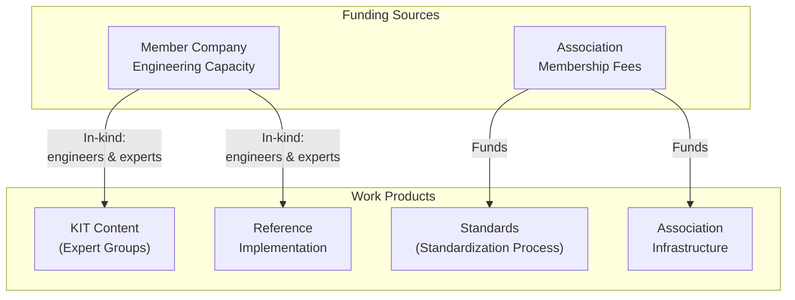
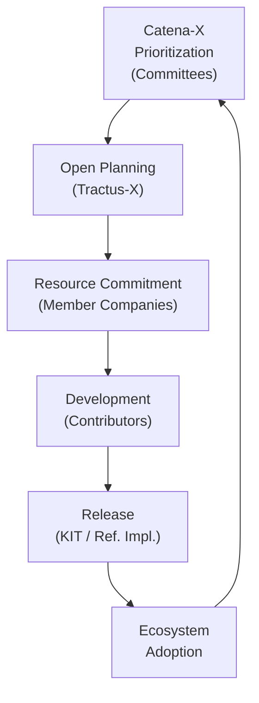

Eclipse Tractus-X is an open-source project — but open source does not mean free of cost. Building and maintaining reference implementations, KITs, architecture documentation, and testing infrastructure requires significant time and expertise. This page explains where those resources come from and how they are funded.

:::info[Key Principle]
Neither Catena-X nor the Eclipse Foundation pays directly for the development of KITs or reference implementations. Resources come from **member companies** that invest their own engineering capacity in the ecosystem.
:::

## Where Does the Money Come From?

### Catena-X Association Membership Fees

Catena-X is financed through **association membership fees** paid by member companies. These fees fund:

- The **Catena-X Association Office** — coordination, administration, and governance support
- **Standardization processes** — tooling, coordination, and editorial work for standards development
- **Conformity assessment infrastructure** — criteria development and certification coordination
- **Community management** — office hours, working-model maintenance, and communication channels

:::note
Association membership fees do **not** flow into the development of software, KITs, or reference implementations in Eclipse Tractus-X. Those are funded separately through in-kind contributions from member companies.
:::

### Member Company In-Kind Contributions

The primary source of resources for KITs and reference implementations is **in-kind contribution**: member companies allocate their own engineers, product managers, and domain experts to work on Tractus-X as part of their strategic commitment to the ecosystem.

This is a deliberate model:

- Companies that want the ecosystem to succeed **invest their own resources** to build it.
- The more a company benefits from a standard being implementable, the more incentive it has to fund that work.
- No single company controls the outcome — contributions go through Eclipse governance and are available to all.

### Eclipse Foundation Infrastructure

The Eclipse Foundation provides the **governance and infrastructure** for Tractus-X at no cost to individual contributors:

- Repository hosting (GitHub under the Eclipse organization)
- CI/CD pipelines and build infrastructure
- Legal framework (IP policies, contributor agreements)
- Community infrastructure (mailing lists, project pages)

The Eclipse Foundation is funded through its own membership model, separate from Catena-X.

---

## Who Funds KIT Development?

KIT development is funded entirely through **in-kind contribution** from Catena-X member companies. The typical model looks like this:

### Who Contributes Resources for KITs?

| Contributor Type | What They Provide |
| --- | --- |
| **Catena-X member companies** | Engineering time for KIT authoring, review, and maintenance |
| **Expert Group participants** | Domain expertise, content creation, standards alignment |
| **Committee members** | Strategic direction, review, and prioritization of KIT scope |
| **Catena-X Association Office** | Coordination, tooling, and process support |

:::tip[Why Companies Invest]
Companies contribute engineering time to KIT development because a well-documented, easy-to-implement standard directly increases adoption of the use cases they depend on. Every company that can implement a standard faster is a potential business partner or customer in the ecosystem.
:::

---

## Who Funds Reference Implementation Development?

Reference implementations are developed and maintained by the **Eclipse Tractus-X open-source community**, which is made up of engineers from Catena-X member companies and other contributors.

### Funding Model for Reference Implementations

There is **no central budget** for reference implementation development. Instead:

1. **Catena-X Committees** identify which reference implementations are strategically needed.
2. **Member companies** that consider a reference implementation valuable commit engineering resources during the **Open Planning** process.
3. Committed features are developed, reviewed, and merged through the Eclipse Tractus-X release process.
4. The resulting implementations are **open source and freely available** to everyone.

:::warning[No Guarantee Without Commitment]
If no member company commits resources to develop a reference implementation, it will not be built — even if Catena-X standards require it. Committees are responsible for ensuring that strategically important implementations have resource backing from member companies during the planning phase.
:::

---

## The Resource Commitment Cycle

The following diagram shows how resource commitment flows through the planning and delivery cycle each release:

This cycle means that **ecosystem adoption creates the business justification** for further investment. As more companies adopt Catena-X standards, more companies benefit from — and fund — their implementation.

---

## Sustainability Considerations

The in-kind contribution model works well when member companies are actively engaged, but it creates risks that association members should be aware of:

:::warning[Funding Risks]

- **Resource gaps**: A strategically important KIT or reference implementation may not get built if no member company steps up to fund it.
- **Concentration risk**: If one or two companies fund most of the development, losing those contributors can leave gaps in maintenance.
- **Prioritization misalignment**: Companies fund what benefits them — this may not always align with what the broader ecosystem needs most.

:::

Catena-X Committees are responsible for monitoring these risks and proactively coordinating resource commitments from member companies before each release cycle begins.

---

## Summary

| Question | Answer |
| --- | --- |
| Who funds the Catena-X Association? | Member companies via association membership fees |
| Who funds KIT development? | Member companies via in-kind contribution (engineering time) |
| Who funds reference implementation development? | Member companies via in-kind contribution to Eclipse Tractus-X |
| Who funds Eclipse Tractus-X infrastructure? | Eclipse Foundation (its own membership model) |
| Is there a central development budget? | No — all development relies on voluntary resource commitment |
| What happens if no one commits resources? | The work does not get done; Committees must close the gap |

:::warning[NOTE]
This is not a normative document.
:::

## Further Reading

- [Overview](./tractus-x-overview.md) — the three-layer model
- [Responsibilities](./responsibilities.md) — who owns reference implementations and KITs
- [Contribution Process](./contribution-process.md) — how Catena-X content flows into Eclipse Tractus-X
