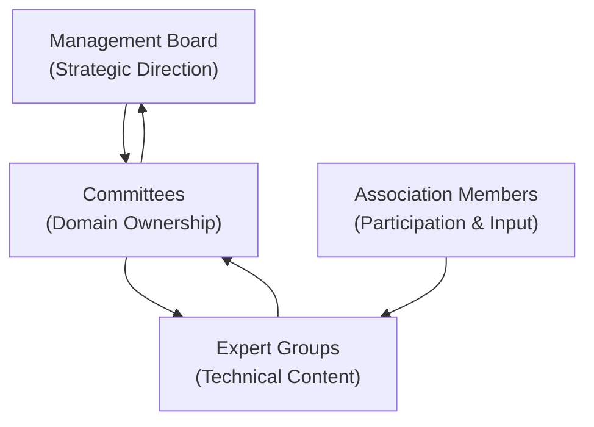
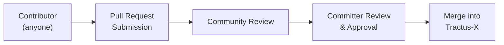
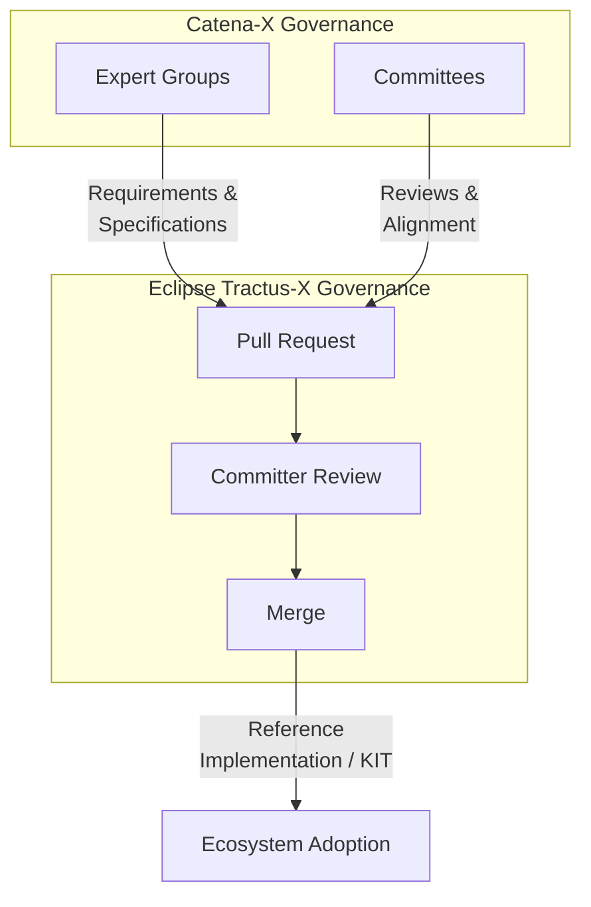

Catena-X and Eclipse Tractus-X operate under two distinct governance frameworks. While they are closely aligned in purpose, they are organizationally independent and follow different rules, processes, and decision-making structures.

:::info[Important]
Catena-X drives **what** is built. Eclipse Tractus-X governs **how** it is built and maintained as open source.
:::

## Catena-X Governance

Catena-X is organized as a registered association (*eingetragener Verein*, e.V.) under German law. Its governance is defined by association bylaws and internal regulations. The key governance bodies are:

| Body | Role |
| --- | --- |
| **Management Board** | Strategic leadership; sets the direction and priorities for the association |
| **Committees** | Own business domains; define standards and use cases; oversee KITs in their domain |
| **Expert Groups** | Develop the technical and domain content; produce standards candidates and specifications |
| **Association Office** | Administrative and coordination support; reviews new working-model content |

### How Decisions Are Made in Catena-X

1. **Expert Groups** research, discuss, and draft standards candidates or specifications.
2. **Committees** review and approve those outputs, ensuring business alignment.
3. The **Management Board** provides strategic oversight and resolves escalations.
4. All association members can participate in Expert Groups and provide input to Committees.

## Eclipse Tractus-X Governance

Eclipse Tractus-X is an open-source project hosted under the [Eclipse Foundation](https://www.eclipse.org/). It follows the **Eclipse Development Process (EDP)**, which is designed to guarantee vendor neutrality, transparency, and long-term sustainability.

Key roles in Eclipse Tractus-X governance:

| Role | Description |
| --- | --- |
| **Committers** | Elected contributors who have earned write access to Tractus-X repositories through demonstrated merit; final authority on merging changes |
| **Contributors** | Anyone who submits pull requests or participates in the open-source community |
| **Project Lead** | Coordinates the overall direction of the Eclipse Tractus-X project |
| **Eclipse Foundation** | Provides legal, infrastructure, and governance oversight |

### How Decisions Are Made in Eclipse Tractus-X

Changes to Tractus-X repositories — including reference implementations, KITs, and documentation — **must** follow the Eclipse Development Process:

1. **Contribution is submitted** as a pull request (PR) to a Tractus-X repository.
2. **The PR is reviewed** by one or more Committers and community members.
3. **Committers approve and merge** the PR after sufficient review.

No change can be merged without Committer approval, regardless of who submitted it — including Catena-X Expert Groups or Committees.

:::warning[NOTE]
Even if a contribution originates from a Catena-X Expert Group or Committee, it must still go through the Eclipse pull request and committer review process. Catena-X has no authority to bypass Eclipse Foundation governance.
:::

## How the Two Governance Systems Interact

The two governance systems interact primarily through the **contribution process**: Catena-X produces requirements and specifications; Eclipse Tractus-X turns them into open-source software and documentation.

### Alignment Without Overriding

Catena-X influences the Tractus-X roadmap through:

- **Open Planning meetings** — where Committees and Expert Groups can propose features and priorities
- **Contributions** — association members actively contribute content and code
- **Communication channels** — Tractus-X mailing lists, Matrix chat, and community calls

However, Catena-X does **not** control Tractus-X repositories. All merges are governed solely by the Eclipse committer process.

## Why This Model Is Effective

The dual-governance model provides three critical guarantees:

:::tip[Vendor Neutrality]
No single company — including founding members of Catena-X — can unilaterally control what gets merged into Tractus-X. Committers are elected based on merit, not company affiliation.
:::

:::tip[Transparency]
All contributions, reviews, and decisions are publicly visible in Tractus-X repositories. Anyone can see why a change was accepted or rejected.
:::

:::tip[Long-Term Sustainability]
Eclipse Foundation governance ensures that Tractus-X can survive changes in the Catena-X membership landscape. The open-source project is not dependent on any individual company's continued participation.
:::

## Further Reading

- [Overview](./tractus-x-overview.md) — the three-layer model
- [Responsibilities](./responsibilities.md) — who owns reference implementations and KITs
- [Contribution Process](./contribution-process.md) — step-by-step guide for contributing from Catena-X to Tractus-X
