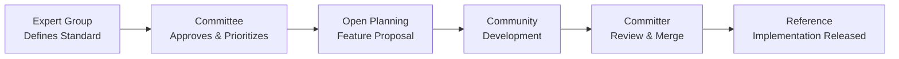
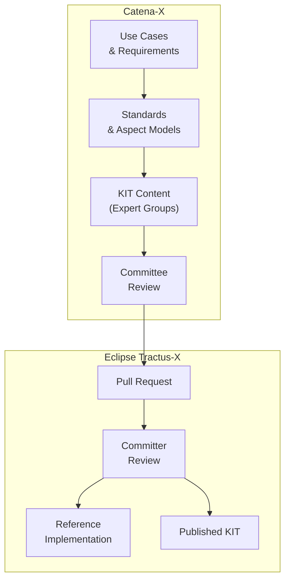

A clear separation of responsibilities between Catena-X and Eclipse Tractus-X is fundamental to the ecosystem's success. This page defines who owns what, with a particular focus on **reference implementations** and **KITs** — the two artifact types most relevant to association members.

## High-Level Responsibility Split

| Area | Catena-X (Association) | Eclipse Tractus-X (Open Source) |
| --- | --- | --- |
| Use cases | ✅ Defines and owns | Implements |
| Data standards | ✅ Defines and owns | Implements |
| Semantic / aspect models | ✅ Defines and owns | Implements |
| Conformity assessment criteria | ✅ Defines and owns | — |
| Reference implementations | Drives requirements | ✅ Develops and maintains |
| KITs | ✅ Owns content & structure | ✅ Hosts and maintains in repo |
| Architecture patterns | Provides requirements | ✅ Develops and maintains |
| Open documentation | Contributes content | ✅ Publishes and maintains |
| Certification | ✅ Owns | — |

## Reference Implementations

### What Is a Reference Implementation?

A **reference implementation** is a working software component that demonstrates how a Catena-X standard can be correctly implemented. It is:

- **Normative in behavior** — it correctly implements the standard it is based on
- **Open source** — hosted in Eclipse Tractus-X repositories
- **Reusable** — can be adopted, forked, or used as a template by ecosystem participants

:::info[Important]
A reference implementation is not a production-ready product. It is a technical demonstration of standard compliance that others can build upon.
:::

### Who Is Responsible for Reference Implementations?

| Responsibility | Owner |
| --- | --- |
| Defining what must be implemented | **Catena-X Expert Groups & Committees** |
| Prioritizing implementation work | **Catena-X Committees** (via Open Planning) |
| Developing the implementation | **Eclipse Tractus-X community contributors** |
| Reviewing and approving code | **Eclipse Tractus-X Committers** |
| Maintaining the implementation | **Eclipse Tractus-X community** |
| Quality and conformance criteria | **Catena-X Committees** |

### How Reference Implementations Are Initiated

## KITs — Keep It Together

### What Is a KIT?

A **KIT (Keep It Together)** is a comprehensive implementation guide that bundles everything a developer or integrator needs to implement a Catena-X use case or standard. A KIT typically includes:

- **Adoption view** — business context and value proposition
- **Development view** — technical specifications, APIs, protocols, and data models
- **Operation view** — deployment and operational guidance
- **Reference to standards** — links to the normative Catena-X standards the KIT implements
- **Reference to implementations** — links to the Eclipse Tractus-X reference implementations

:::tip[Why KITs Matter]
KITs are the bridge between abstract standards and practical implementation. Without KITs, standards are difficult to adopt, companies cannot implement quickly, and interoperability suffers.
:::

### Who Is Responsible for KITs?

| Responsibility | Owner |
| --- | --- |
| Defining the scope and content of a KIT | **Catena-X Committees** (per domain) |
| Creating KIT content (adoption view, dev view, etc.) | **Catena-X Expert Groups** (authors) |
| Reviewing KIT content for standards alignment | **Catena-X Committees** |
| Submitting KIT content to Tractus-X | **Expert Group members / Contributors** |
| Reviewing the pull request | **Eclipse Tractus-X Committers** |
| Merging and publishing in Tractus-X | **Eclipse Tractus-X Committers** |
| Maintaining KIT content over releases | **Catena-X Expert Groups** (ongoing) |

:::warning[NOTE]
While Catena-X drives the content of KITs, the final authority on what is merged into the Eclipse Tractus-X repository lies with the **Eclipse Tractus-X Committers**. Catena-X cannot force a merge.
:::

### KIT Ownership Per Domain

Each Catena-X Committee owns the KITs in its business domain. The Committee is responsible for:

1. Ensuring the KIT exists for each relevant use case in its domain
2. Keeping KIT content up to date as standards evolve
3. Coordinating with Expert Groups to produce KIT content
4. Aligning with the Tractus-X release schedule for KIT updates

## Summary: The Responsibility Flow

## Further Reading

- [Overview](./tractus-x-overview.md) — the three-layer model
- [Governance Model](./governance-model.md) — how both governance systems work
- [Contribution Process](./contribution-process.md) — step-by-step guide for getting content into Tractus-X
- [Funding & Resources](./funding.md) — where the money and engineering capacity come from
