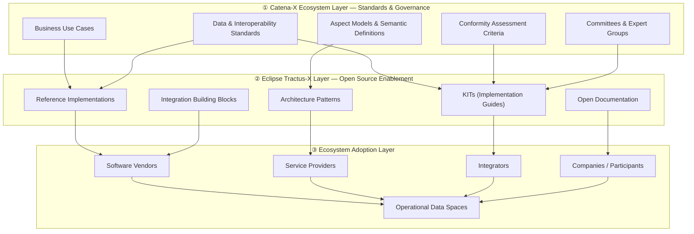

Catena-X and Eclipse Tractus-X are two distinct but deeply connected initiatives that together form the backbone of the Catena-X automotive data ecosystem. Understanding the relationship between them is essential for every association member, contributor, and ecosystem participant.

:::info[Key Principle]
**Catena-X defines WHAT the ecosystem needs.**
**Eclipse Tractus-X provides HOW it can be implemented.**
:::

## The Three-Layer Model

The relationship between Catena-X and Eclipse Tractus-X can best be understood through a three-layer architecture that describes the flow from ecosystem governance to open-source enablement and finally to real-world adoption.

### Layer 1: Catena-X Ecosystem Layer

Catena-X governs and defines the ecosystem. This layer establishes:

- **Business Use Cases** — the concrete scenarios the ecosystem must support
- **Data & Interoperability Standards** — the normative rules for data exchange
- **Aspect Models & Semantic Definitions** — shared semantics enabling machine-readable data exchange
- **Conformity Assessment Criteria** — the criteria used to certify compliant solutions
- **Committees & Expert Groups** — the governance bodies that develop and maintain all of the above

This layer answers the question: **What does the ecosystem need?**

### Layer 2: Eclipse Tractus-X Layer

Eclipse Tractus-X is an open-source project under the Eclipse Foundation. It translates Catena-X standards and requirements into concrete, reusable software artifacts:

- **Reference Implementations** — working software components that implement Catena-X standards
- **KITs (Keep It Together)** — implementation guides that package standards, reference implementations, and documentation into actionable guidance
- **Architecture Patterns** — reusable integration and design patterns
- **Integration Building Blocks** — software components teams can adopt and extend
- **Open Documentation** — publicly accessible technical documentation

This layer answers the question: **How can the ecosystem implement the standards?**

### Layer 3: Ecosystem Adoption Layer

The Adoption Layer represents the real-world use of Tractus-X artifacts. Software vendors, service providers, integrators, and participant companies consume Tractus-X building blocks to build products, services, and platforms — resulting in operational data spaces.

---

## Why This Separation Matters

The two-governance model is a deliberate design choice, not an organizational accident.

| Aspect | Catena-X | Eclipse Tractus-X |
| --- | --- | --- |
| **Type** | Industry association (e.V.) | Eclipse Foundation open-source project |
| **Governance** | Association bylaws & committee decisions | Eclipse Development Process (EDP) |
| **Primary output** | Standards, use cases, certification criteria | Reference implementations, KITs, open documentation |
| **Membership** | Association members (fee-based) | Open to all (contributor model) |
| **Decision authority** | Management Board, Committees, Expert Groups | Committers (elected by merit) |

This separation ensures:

- **Vendor neutrality** — no single company controls the open-source implementations
- **Transparency** — all code changes are public and auditable
- **Sustainability** — Eclipse Foundation governance outlasts any individual company's involvement
- **Trust** — essential for industrial data ecosystems where competitors collaborate

:::tip[Summary]
Catena-X defines the ecosystem and standards.
Eclipse Tractus-X provides the open-source implementation layer that makes the ecosystem technically possible and broadly adoptable.
:::

## Further Reading

- [Governance Model](./governance-model.md) — in-depth look at how both governance systems work and interact
- [Responsibilities](./responsibilities.md) — who is responsible for reference implementations and KITs
- [Contribution Process](./contribution-process.md) — how Catena-X content flows into Eclipse Tractus-X

:::warning[NOTE]
This is not a normative document.
:::
